|            | kernel  k-means method                         | spectral clustering (normalized)                            | spectral clustering (ratio)                            |
| ---------- | ---------------------------------------------- | ----------------------------------------------------------- | ------------------------------------------------------ |
|            | random                                         | random                                                      | random                                                 |
| 2 clusters | [GIF](./gif/image1_kernel_random_2clusters.gif) | [GIF](./gif/image1_spectral_normalized_random_2clusters.gif) | [GIF](./gif/image1_spectral_ratio_random_2clusters.gif) |
| 3 clusters | [GIF](./gif/image1_kernel_random_3clusters.gif) | [GIF](./gif/image1_spectral_normalized_random_3clusters.gif) | [GIF](./gif/image1_spectral_ratio_random_3clusters.gif) |
| 4 clusters | [GIF](./gif/image1_kernel_random_4clusters.gif) | [GIF](./gif/image1_spectral_normalized_random_4clusters.gif) | [GIF](./gif/image1_spectral_ratio_random_4clusters.gif) |

|            | kernel  k-means method                           | spectral clustering (normalized)                              | spectral clustering (ratio)                              |
| ---------- | ------------------------------------------------ | ------------------------------------------------------------- | -------------------------------------------------------- |
|            | k-means++                                        | k-means++                                                     | k-means++                                                |
| 2 clusters | [GIF](./gif/image1_kernel_kmeans++_2clusters.gif) | [GIF](./gif/image1_spectral_normalized_kmeans++_2clusters.gif) | [GIF](./gif/image1_spectral_ratio_kmeans++_2clusters.gif) |
| 3 clusters | [GIF](./gif/image1_kernel_kmeans++_3clusters.gif) | [GIF](./gif/image1_spectral_normalized_kmeans++_3clusters.gif) | [GIF](./gif/image1_spectral_ratio_kmeans++_3clusters.gif) |
| 4 clusters | [GIF](./gif/image1_kernel_kmeans++_4clusters.gif) | [GIF](./gif/image1_spectral_normalized_kmeans++_4clusters.gif) | [GIF](./gif/image1_spectral_ratio_kmeans++_4clusters.gif) |

### Image2

|            | kernel  k-means method                                 | spectral clustering (normalized)                                    | spectral clustering (ratio)                                    |
| ---------- | ------------------------------------------------------ | ------------------------------------------------------------------- | -------------------------------------------------------------- |
|            | random                                                 | random                                                              | random                                                         |
| 2 clusters | [GIF](./gif/image2_kernel_random_2clusters.gif)        | [GIF](./gif/image2_spectral_normalized_random_2clusters.gif)        | [GIF](./gif/image2_spectral_ratio_random_2clusters.gif)        |
| 3 clusters | [GIF](./gif/image2_kernel_random_3clusters.gif)        | [GIF](./gif/image2_spectral_normalized_random_3clusters.gif)        | [GIF](./gif/image2_spectral_ratio_random_3clusters.gif)        |
| 4 clusters | [GIF](./gif/image2_kernel_random_4clusters.gif)        | [GIF](./gif/image2_spectral_normalized_random_4clusters.gif)        | [GIF](./gif/image2_spectral_ratio_random_4clusters.gif)        |

|            | kernel  k-means method                                 | spectral clustering (normalized)                                    | spectral clustering (ratio)                                    |
| ---------- | ------------------------------------------------------ | ------------------------------------------------------------------- | -------------------------------------------------------------- |
|            | k-means++                                              | k-means++                                                            | k-means++                                                      |
| 2 clusters | [GIF](./gif/image2_kernel_kmeans++_2clusters.gif)      | [GIF](./gif/image2_spectral_normalized_kmeans++_2clusters.gif)      | [GIF](./gif/image2_spectral_ratio_kmeans++_2clusters.gif)      |
| 3 clusters | [GIF](./gif/image2_kernel_kmeans++_3clusters.gif)      | [GIF](./gif/image2_spectral_normalized_kmeans++_3clusters.gif)      | [GIF](./gif/image2_spectral_ratio_kmeans++_3clusters.gif)      |
| 4 clusters | [GIF](./gif/image2_kernel_kmeans++_4clusters.gif)      | [GIF](./gif/image2_spectral_normalized_kmeans++_4clusters.gif)      | [GIF](./gif/image2_spectral_ratio_kmeans++_4clusters.gif)      |


---


## 1. Code with detailed explanations (30%)

i. Part1 (kernel k-means 5%, normalized cut 5%, ratio cut 5%)

```python
def load_image(image_path):
    img = np.array(Image.open(image_path).convert('RGB'))
    h, w, _ = img.shape
    return img, h, w
```

### kernel k-means
$$
\mathbf{k}(x, x') = e^{-\gamma_s \| S(x) - S(x') \|^2} \times e^{-\gamma_c \| C(x) - C(x') \|^2}

$$

- $S(x)$: spatial coordinate of pixel $x$ (e.g., row, column)
- $C(x)$: color (RGB) value of pixel $x$
- $\gamma_s​$: controls the influence of spatial distance
- $\gamma_c$​: controls the influence of color difference

```python
def compute_kernel_matrix(img, gamma_s, gamma_c):
    h, w, c = img.shape
    N = h * w

    # Create spatial coordinate vectors: S(x)
    spatial = np.array([[i // w, i % w] for i in range(N)])

    # Flatten the image to get color vectors: C(x)
    rgb = img.reshape((-1, 3))

    # Compute pairwise squared distances in spatial domain: ||S(x) - S(x')||^2
    spatial_dists = squareform(pdist(spatial, 'sqeuclidean'))

    # Compute pairwise squared distances in color domain: ||C(x) - C(x')||^2
    rgb_dists = squareform(pdist(rgb, 'sqeuclidean'))

    # Combine both distance matrices using Gaussian kernel
    # k(x, x') = exp(-γ_s * spatial_dist) * exp(-γ_c * color_dist)
    K = np.exp(-gamma_s * spatial_dists) * np.exp(-gamma_c * rgb_dists)

    return K


```

The squared distance between a sample $x_j$ and the centroid $\mu_k^\phi$​ of cluster $k$ in the feature space is:

$$
\left\| \phi(x_j) - \mu_k^{\phi} \right\| ^{2}
= \left\| \phi(x_j) - \frac{1}{|C_k|} \sum_{n=1}^{N} \alpha_{kn} \phi(x_n) \right\| ^{2}
$$
Expanding this using kernel functions:
$$
= \underbrace{\mathbf{k}(x_j, x_j)}_{self similarity} - \frac{2}{|C_k|} \sum_{n} \alpha_{kn} \mathbf{k}(x_j, x_n)
+ \frac{1}{|C_k|^2} \sum_{p} \sum_{q} \alpha_{kp} \alpha_{kq} \mathbf{k}(x_p, x_q)
$$
- $\phi(x)$: The high-dimensional mapping of $x$
- $\mu_k^\phi$​: The centroid of cluster $k$ in the feature space
- $\alpha_{kn}$: 1 if $x_n \in C_k$​; otherwise 0
- $\mathbf{k}(x_i, x_j)$: The kernel function

```python
def kernel_kmeans(K, k, max_iter=100, tol=1e-3, init_method='kmeans++'):
    N = K.shape[0]
    if init_method == 'random':
        np.random.seed(42)
        labels = np.random.randint(0, k, size=N)
    elif init_method == 'kmeans++':
        np.random.seed(42)
        centers = [np.random.randint(0, N)]
        for _ in range(1, k):
            D = np.array([1 - np.max(K[i, centers]) for i in range(N)])
            probs = D ** 2 / np.sum(D ** 2)
            next_center = np.random.choice(N, p=probs)
            centers.append(next_center)
        labels = np.zeros(N, dtype=int)
        for i in range(N):
            labels[i] = np.argmax([K[i, c] for c in centers])
    else:
        raise ValueError("init_method must be 'random' or 'kmeans++'")

    snapshots = []

    for it in range(max_iter):
        cluster_indices = [np.where(labels == c)[0] for c in range(k)]
        intra_K = np.zeros(k)
        for c in range(k):
            idx = cluster_indices[c]
            if len(idx) > 0:
                intra_K[c] = np.sum(K[np.ix_(idx, idx)]) / (len(idx) ** 2)

        new_labels = np.zeros(N, dtype=int)
        for i in range(N):
            best_c = 0
            min_dist = float('inf')
            for c in range(k):
                idx = cluster_indices[c]
                if len(idx) == 0:
                    continue
                term1 = K[i, i]
                term2 = -2 * np.sum(K[i, idx]) / len(idx)
                term3 = intra_K[c]
                dist = term1 + term2 + term3
                if dist < min_dist:
                    min_dist = dist
                    best_c = c
            new_labels[i] = best_c

        snapshots.append(new_labels.copy())
        changed = np.sum(new_labels != labels)
        print(f"Iteration {it + 1}: {changed} points changed.")

        if changed < tol * N:
            print("Converged.")
            break

        labels = new_labels

    return labels, snapshots

```

#### ▪ Step 1: Compute intra-cluster kernel terms

For each cluster $c$:
- Find all indices $i$ assigned to cluster $c$.
- Compute:
    $$
    \text{intra\_K}[c] = \frac{1}{|C_c|^2} \sum_{i,j \in C_c} K[i,j]
    $$
- This represents the squared norm of the centroid $\mu_c^\phi$ in feature space.
#### ▪ Step 2: Assign new cluster labels

For each data point xix_ixi​, compute its distance to each cluster centroid using:

$$
\text{dist}(x_i, C_c) = K[i, i] - \frac{2}{|C_c|} \sum_{j \in C_c} K[i, j] + \text{intra\_K}[c]
$$
- Assign point to the cluster with the **minimum kernel-based distance**.
#### ▪ Step 3: Check convergence
- Count how many points changed labels.
- If `changed < tol * N`, stop early (converged).

```python
def kernel_kmeans_pipeline(image_path, n_clusters, gamma_s, gamma_c, init_method='kmeans++'):
    img, h, w = load_image(image_path)
    K = compute_kernel_matrix(img, gamma_s, gamma_c)
    labels, snapshots = kernel_kmeans(K, n_clusters, init_method=init_method)
    file_prefix = f"{os.path.splitext(os.path.basename(image_path))[0]}_kernel_{init_method}_{n_clusters}clusters"
    save_gif_and_png(snapshots, h, w, n_clusters, file_prefix)
```

Executes the full kernel k-means clustering pipeline on an image.
Includes feature extraction, kernel computation, clustering, and visualization
### spectral clustering

Spectral Clustering is a graph-based clustering algorithm that uses the eigenvectors of the graph Laplacian to embed the data into a lower-dimensional space, where K-Means can then be applied.

```python

def construct_laplacian(W, method='normalized'):
    D = np.diag(np.sum(W, axis=1))
    if method == 'ratio':
        return D - W
    elif method == 'normalized':
        D_inv_sqrt = np.diag(1.0 / np.sqrt(np.diag(D)))
        return np.identity(W.shape[0]) - D_inv_sqrt @ W @ D_inv_sqrt
    else:
        raise ValueError("method must be 'normalized' or 'ratio'")


```

- Constructs the **graph Laplacian matrix** used in Spectral Clustering.
- `W` is the **similarity (adjacency) matrix**, typically derived from a kernel.
- Two common variants:
    - **Ratio cut (unnormalized):**
        $$
        L = D - W
        $$
    - **Normalized cut (symmetric):**
        $$
        L_{\text{sym}} = I - D^{-1/2} W D^{-1/2}
        $$
Where:
- $D$: Degree matrix, a diagonal matrix with  $D_{ii} = \sum_j W_{ij}$
- $I$: Identity matrix

```python
def spectral_embedding(L, n_clusters, skip_first=True):
    eigvals, eigvecs = eigh(L)
    start_idx = 1 if skip_first else 0
    U = eigvecs[:, start_idx:start_idx + n_clusters]
    return U / np.linalg.norm(U, axis=1, keepdims=True)

```

- Performs **eigen-decomposition** of the Laplacian matrix $L$ to obtain the **embedding matrix** $U$.
- This embedding captures the geometry of the data graph.
- The first eigenvector is usually skipped (`skip_first=True`) because:
    - For normalized Laplacian: the first eigenvalue is 0 and corresponds to the trivial constant eigenvector.
Output:
- $U \in \mathbb{R}^{N \times k}$ where each row is the projection of a point into the **spectral space**.
Why normalize the rows?
- Row-wise normalization ensures that clustering is based on **direction** (angular similarity) in the spectral space.

```python
def kmeans(X, k, max_iter=100, tol=1e-4, init_method='kmeans++'):
    N = X.shape[0]
    centers = initialize_kmeans(X, k, init_method)
    labels = np.zeros(N, dtype=int)
    snapshots = []

    for it in range(max_iter):
        dists = np.linalg.norm(X[:, None, :] - centers[None, :, :], axis=2)
        new_labels = np.argmin(dists, axis=1)
        snapshots.append(new_labels.copy())

        if np.sum(new_labels != labels) < tol * N:
            print(f"Converged at iteration {it + 1}")
            break

        labels = new_labels
        for i in range(k):
            if np.any(labels == i):
                centers[i] = X[labels == i].mean(axis=0)

    return labels, snapshots
```

- Applies the **K-Means algorithm** to points in the **spectral embedding space**.
- Used after computing eigenvectors of the Laplacian.
- Initialization supports:
    - `'random'`: randomly choose initial centroids
    - `'kmeans++'`: probabilistic spread-out selection of centroids
- Tracks label changes across iterations for convergence.

```python
def spectral_clustering_pipeline(image_path, n_clusters, gamma_s, gamma_c, method='normalized', init_method='kmeans++'):
    img, h, w = load_image(image_path)
    K = compute_kernel_matrix(img, gamma_s, gamma_c)
    L = construct_laplacian(K, method)
    U = spectral_embedding(L, n_clusters)
    labels, snapshots = kmeans(U, n_clusters, init_method=init_method)
    file_prefix = f"{os.path.splitext(os.path.basename(image_path))[0]}_spectral_{method}_{init_method}_{n_clusters}clusters"
    save_gif_and_png(snapshots, h, w, n_clusters, file_prefix)
    visualize_eigenspace(U, labels, file_prefix)
```

1. **Load image** and extract its RGB data and shape.
2. **Compute the kernel matrix** $K$ using both spatial and color similarities.
3. **Construct the graph Laplacian** (`L`) using ratio or normalized method.
4. **Compute eigenvectors** of the Laplacian and extract the top `n_clusters` ones as embedding matrix `U`.
5. **Apply K-Means** in the eigenspace to cluster pixels.
6. **Save results** as a `.gif` (animated clustering) and `.png` (final output).
7. **Visualize the eigenspace** (2D or 3D scatter plot of eigenvectors with cluster colors)

### Part4: Experiments on the coordinates in the eigenspace

visualize the coordinates of each data point (e.g., image pixel) in that eigenspace, colored by its final cluster assignment.

```python
def visualize_eigenspace(U, labels, file_prefix, output_dir='./eigenspace_vis'):
    os.makedirs(output_dir, exist_ok=True)
    k = U.shape[1]
    fig_path = os.path.join(output_dir, f"{file_prefix}_eigenspace.png")
    if k == 2:
        plt.figure(figsize=(8, 6))
        for c in np.unique(labels):
            plt.scatter(U[labels == c, 0], U[labels == c, 1], label=f"Cluster {c}", s=5)
        plt.xlabel("Eigenvector 1")
        plt.ylabel("Eigenvector 2")
        plt.title("Eigenspace Visualization (2D)")
        plt.legend()
        plt.grid(True)
        plt.savefig(fig_path)
        plt.close()
        print(f"Eigenspace plot saved to: {fig_path}")
    elif k == 3:
        fig = plt.figure(figsize=(10, 8))
        ax = fig.add_subplot(111, projection='3d')
        for c in np.unique(labels):
            ax.scatter(U[labels == c, 0], U[labels == c, 1], U[labels == c, 2], label=f"Cluster {c}", s=5)
        ax.set_title("Eigenspace Visualization (3D)")
        ax.set_xlabel("Eigenvector 1")
        ax.set_ylabel("Eigenvector 2")
        ax.set_zlabel("Eigenvector 3")
        ax.legend()
        plt.savefig(fig_path)
        plt.close()
        print(f"Eigenspace 3D plot saved to: {fig_path}")
    else:
        print(f"[Warning] Eigenspace visualization only supported for k=2 or 3 (got k={k}). Skipped.")
```
<div style="page-break-after: always;"></div>

- `U`: Spectral embedding matrix (shape: $N \times k$), where each row is the coordinate of a data point in eigenspace.
- `labels`: Cluster assignments for each point.
- `file_prefix`: Output file naming base.
- `output_dir`: Directory to save the image.

Output

- Saves a `.png` image showing:
    - **2D scatter plot** (if $k=2$)
    - **3D scatter plot** (if $k=3$)
- Each point is colored by its cluster label.

```python
def spectral_clustering_pipeline(...):
    ...
    save_gif_and_png(snapshots, h, w, n_clusters, file_prefix)
    visualize_eigenspace(U, labels, file_prefix)
```


---

```python
def labels_to_rgb(labels, n_clusters):
    colormap = plt.get_cmap("tab10", n_clusters)
    colors = (colormap(np.arange(n_clusters))[:, :3] * 255).astype(np.uint8)
    return colors[labels]
```

```python
def save_gif_and_png(snapshots, h, w, n_clusters, file_prefix, output_dir="./output"):
    os.makedirs(output_dir, exist_ok=True)
    gif_frames = []
    for labels in snapshots:
        rgb_img = labels_to_rgb(labels, n_clusters).reshape(h, w, 3)
        gif_frames.append(rgb_img)

    gif_path = os.path.join(output_dir, f"{file_prefix}.gif")
    imageio.mimsave(gif_path, gif_frames, format='GIF', duration=0.5)
    print(f"Saved GIF to {gif_path}")

    png_path = os.path.join(output_dir, f"{file_prefix}_final.png")
    final_frame = gif_frames[-1]
    Image.fromarray(final_frame).save(png_path)
    print(f"Saved final PNG to {png_path}")
```

- Converts each label map (from `snapshots`) to an RGB image.
- Creates an animated `.gif` of the entire clustering process.
- Saves the final frame (last iteration) as a `.png`.

```python
def run_all_configs(image_path, gamma_s, gamma_c, n_clusters_list, init_methods, modes, laplacian_methods):
    for mode in modes:
        for init_method in init_methods:
            for n_clusters in n_clusters_list:
                if mode == 'kernel':
                    print(f"\n[Kernel K-Means] clusters={n_clusters}, init={init_method}")
                    try:
                        kernel_kmeans_pipeline(
                            image_path=image_path,
                            n_clusters=n_clusters,
                            gamma_s=gamma_s,
                            gamma_c=gamma_c,
                            init_method=init_method
                        )
                    except Exception as e:
                        print(f"Error in kernel_kmeans_pipeline: {e}")

                elif mode == 'spectral':
                    for lap_method in laplacian_methods:
                        print(f"\n[Spectral Clustering] clusters={n_clusters}, init={init_method}, laplacian={lap_method}")
                        try:
                            spectral_clustering_pipeline(
                                image_path=image_path,
                                n_clusters=n_clusters,
                                gamma_s=gamma_s,
                                gamma_c=gamma_c,
                                method=lap_method,
                                init_method=init_method
                            )
                        except Exception as e:
                            print(f"Error in spectral_clustering_pipeline: {e}")

                else:
                    print(f"Unknown mode: {mode}")


```

Runs **batch experiments** for all combinations of clustering mode, number of clusters, initialization methods, and Laplacian types.

Parameters:
- `image_path`: Path to the input image.
- `gamma_s`, `gamma_c`: Kernel parameters for spatial and color similarity.
- `n_clusters_list`: List of values for number of clusters (e.g., `[2, 3, 4]`).
- `init_methods`: List of initialization strategies (e.g., `['random', 'kmeans++']`).
- `modes`: `['kernel', 'spectral']` for selecting clustering algorithms.
- `laplacian_methods`: Applicable only if mode is `'spectral'` (e.g., `['ratio', 'normalized']`).
Features:
- Each configuration will:
    - Print progress and configuration info.
    - Attempt to run the full pipeline and handle exceptions gracefully.
- Output includes `.gif`, `.png`, and optional eigenspace plots.
<div style="page-break-after: always;"></div>
## 2. Experiments settings and results(30%) & discussion (20%)

### Part1+Part2 + Part3
**<font color="#c00000" >[TA  Can See the GIF images version in this link](https://github.com/ouoxii/NYCU-Machine-Learning/blob/master/hw6/README.md)</font>**
```python
if __name__ == "__main__":
    gamma_s = 0.001
    gamma_c = 0.001
    n_clusters_list = [2, 3, 4] # Part2: Try more clusters (5%)
    init_methods = ['random', 'kmeans++'] # Part3: Try different initializations. (5%)
    modes = ['kernel', 'spectral']
    laplacian_methods = ['ratio', 'normalized']

    for i in range(1, 3):
        image_path = f"./image{i}.png"
        run_all_configs(
            image_path=image_path,
            gamma_s=gamma_s,
            gamma_c=gamma_c,
            n_clusters_list=n_clusters_list,
            init_methods=init_methods,
            modes=modes,
            laplacian_methods=laplacian_methods
        )
```

Image1
|            | kernel  k-means method                         | spectral clustering (normalized)                            | spectral clustering (ratio)                            |
| ---------- | ---------------------------------------------- | ----------------------------------------------------------- | ------------------------------------------------------ |
|            | random                                         | random                                                      | random                                                 |
| 2 clusters | [GIF](./gif/image1_kernel_random_2clusters.gif) | [GIF](./gif/image1_spectral_normalized_random_2clusters.gif) | [GIF](./gif/image1_spectral_ratio_random_2clusters.gif) |
| 3 clusters | [GIF](./gif/image1_kernel_random_3clusters.gif) | [GIF](./gif/image1_spectral_normalized_random_3clusters.gif) | [GIF](./gif/image1_spectral_ratio_random_3clusters.gif) |
| 4 clusters | [GIF](./gif/image1_kernel_random_4clusters.gif) | [GIF](./gif/image1_spectral_normalized_random_4clusters.gif) | [GIF](./gif/image1_spectral_ratio_random_4clusters.gif) |

|            | kernel  k-means method                           | spectral clustering (normalized)                              | spectral clustering (ratio)                              |
| ---------- | ------------------------------------------------ | ------------------------------------------------------------- | -------------------------------------------------------- |
|            | k-means++                                        | k-means++                                                     | k-means++                                                |
| 2 clusters | [GIF](./gif/image1_kernel_kmeans++_2clusters.gif) | [GIF](./gif/image1_spectral_normalized_kmeans++_2clusters.gif) | [GIF](./gif/image1_spectral_ratio_kmeans++_2clusters.gif) |
| 3 clusters | [GIF](./gif/image1_kernel_kmeans++_3clusters.gif) | [GIF](./gif/image1_spectral_normalized_kmeans++_3clusters.gif) | [GIF](./gif/image1_spectral_ratio_kmeans++_3clusters.gif) |
| 4 clusters | [GIF](./gif/image1_kernel_kmeans++_4clusters.gif) | [GIF](./gif/image1_spectral_normalized_kmeans++_4clusters.gif) | [GIF](./gif/image1_spectral_ratio_kmeans++_4clusters.gif) |

### Image2

|            | kernel  k-means method                                 | spectral clustering (normalized)                                    | spectral clustering (ratio)                                    |
| ---------- | ------------------------------------------------------ | ------------------------------------------------------------------- | -------------------------------------------------------------- |
|            | random                                                 | random                                                              | random                                                         |
| 2 clusters | [GIF](./gif/image2_kernel_random_2clusters.gif)        | [GIF](./gif/image2_spectral_normalized_random_2clusters.gif)        | [GIF](./gif/image2_spectral_ratio_random_2clusters.gif)        |
| 3 clusters | [GIF](./gif/image2_kernel_random_3clusters.gif)        | [GIF](./gif/image2_spectral_normalized_random_3clusters.gif)        | [GIF](./gif/image2_spectral_ratio_random_3clusters.gif)        |
| 4 clusters | [GIF](./gif/image2_kernel_random_4clusters.gif)        | [GIF](./gif/image2_spectral_normalized_random_4clusters.gif)        | [GIF](./gif/image2_spectral_ratio_random_4clusters.gif)        |

|            | kernel  k-means method                                 | spectral clustering (normalized)                                    | spectral clustering (ratio)                                    |
| ---------- | ------------------------------------------------------ | ------------------------------------------------------------------- | -------------------------------------------------------------- |
|            | k-means++                                              | k-means++                                                            | k-means++                                                      |
| 2 clusters | [GIF](./gif/image2_kernel_kmeans++_2clusters.gif)      | [GIF](./gif/image2_spectral_normalized_kmeans++_2clusters.gif)      | [GIF](./gif/image2_spectral_ratio_kmeans++_2clusters.gif)      |
| 3 clusters | [GIF](./gif/image2_kernel_kmeans++_3clusters.gif)      | [GIF](./gif/image2_spectral_normalized_kmeans++_3clusters.gif)      | [GIF](./gif/image2_spectral_ratio_kmeans++_3clusters.gif)      |
| 4 clusters | [GIF](./gif/image2_kernel_kmeans++_4clusters.gif)      | [GIF](./gif/image2_spectral_normalized_kmeans++_4clusters.gif)      | [GIF](./gif/image2_spectral_ratio_kmeans++_4clusters.gif)      |

<div style="page-break-after: always;"></div>

### Part4

To observe how well-separated the clusters are in the spectral embedding space (formed by the Laplacian’s eigenvectors). Better separability in eigenspace often leads to more reliable clustering.


|            | spectral clustering (normalized)                                                  | spectral clustering (ratio)                                                  |
| ---------- | --------------------------------------------------------------------------------- | ---------------------------------------------------------------------------- |
|            | random                                                                            | random                                                                       |
| 2 clusters | 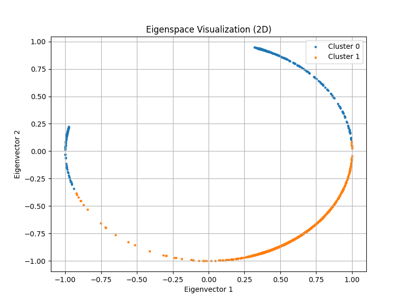 | 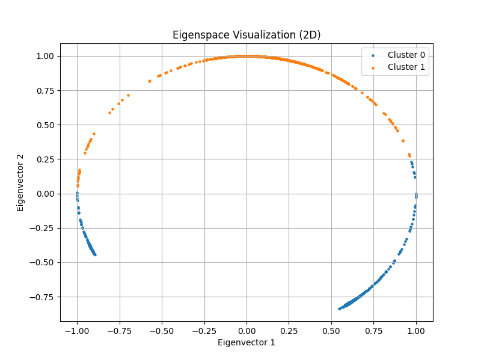 |
| 3 clusters | 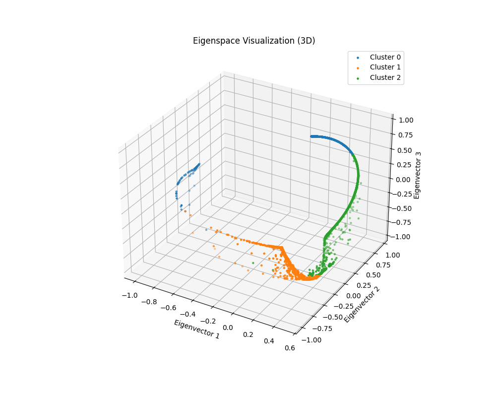 | 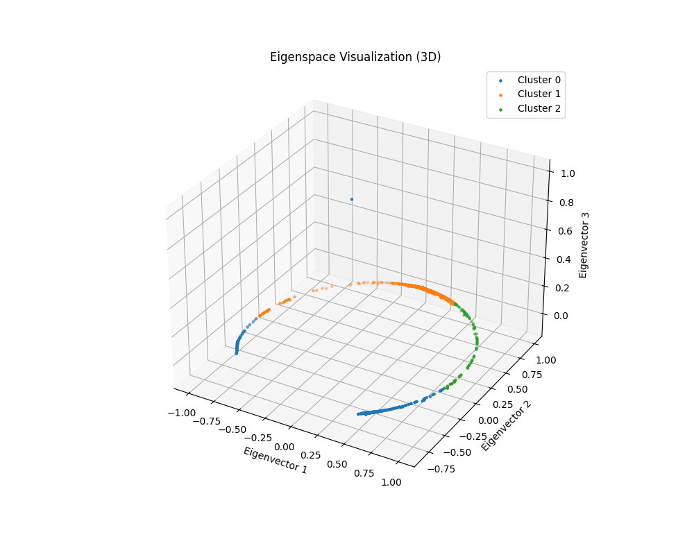 |


|            | spectral clustering (normalized)                                                    | spectral clustering (ratio)                                                    |
| ---------- | ----------------------------------------------------------------------------------- | ------------------------------------------------------------------------------ |
|            | kmeans++                                                                            | kmeans++                                                                       |
| 2 clusters | 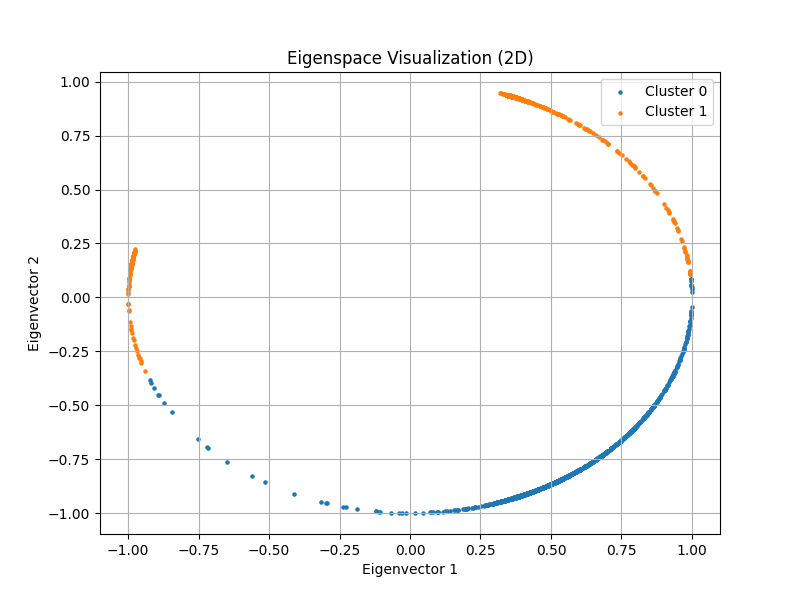 | 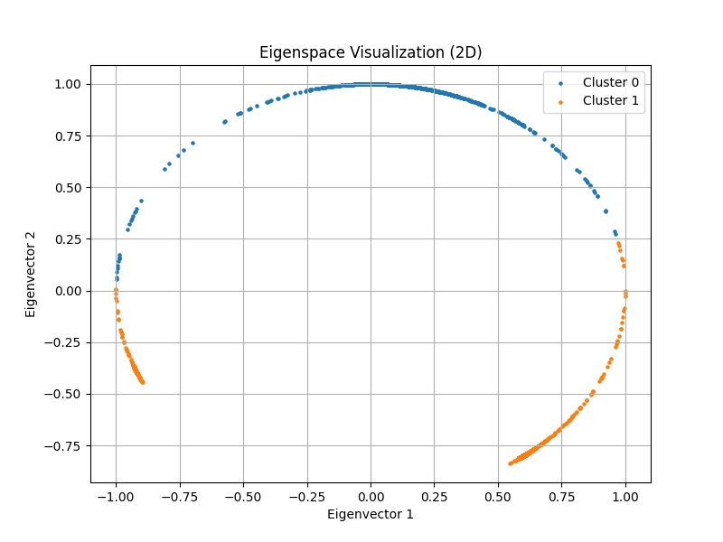 |
| 3 clusters | 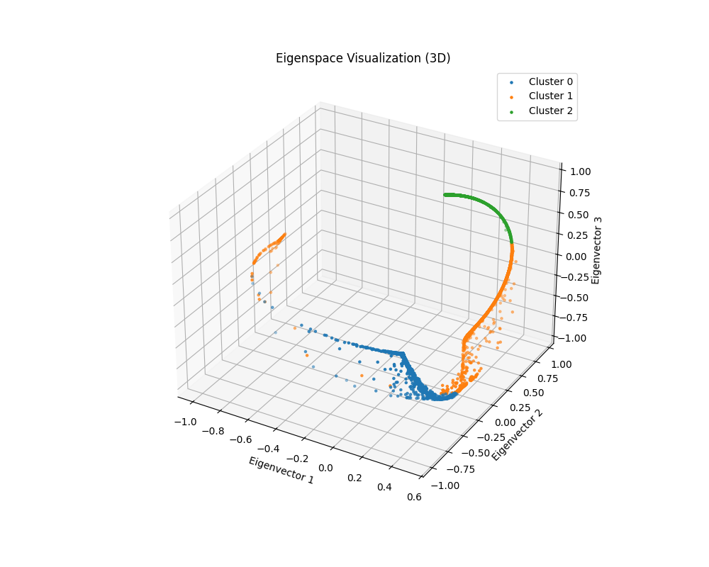 |  |

| Aspect                  | Spectral (Normalized)          | Spectral (Ratio)                   |
| ----------------------- | ------------------------------ | ---------------------------------- |
| **2 Clusters**          | Strong structure, circular arc | Same; slightly tighter clusters    |
| **3 Clusters**          | Smooth curved embedding, good  | More compact but slightly sparse   |
| **k-means++ vs Random** | Improves clarity               | Greatly improves density & balance |
- The **eigenspace structure of Image1** is **strongly curved**, which makes spectral clustering ideal.

- **Normalized Laplacian** provides smoother embeddings.

- **Ratio Laplacian** benefits more from **k-means++**, especially at higher cluster counts.

image2

|            | spectral clustering (normalized)                                                  | spectral clustering (ratio)                                                  |
| ---------- | --------------------------------------------------------------------------------- | ---------------------------------------------------------------------------- |
|            | random                                                                            | random                                                                       |
| 2 clusters | 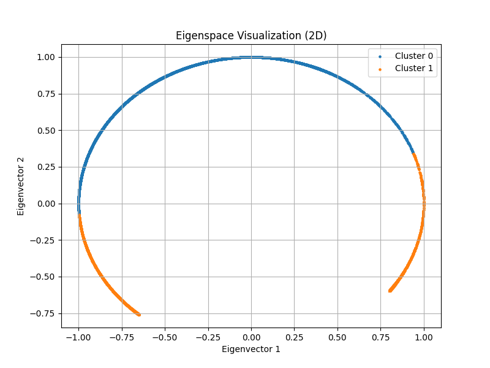 | 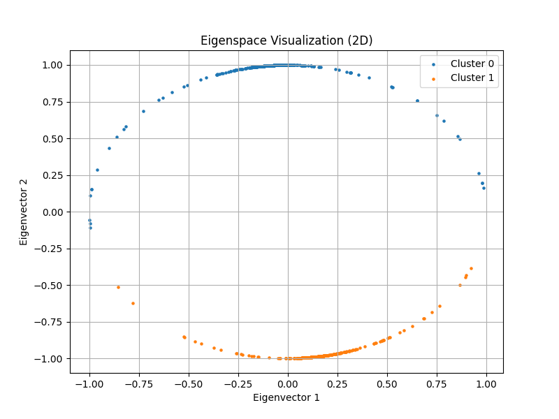 |
| 3 clusters | 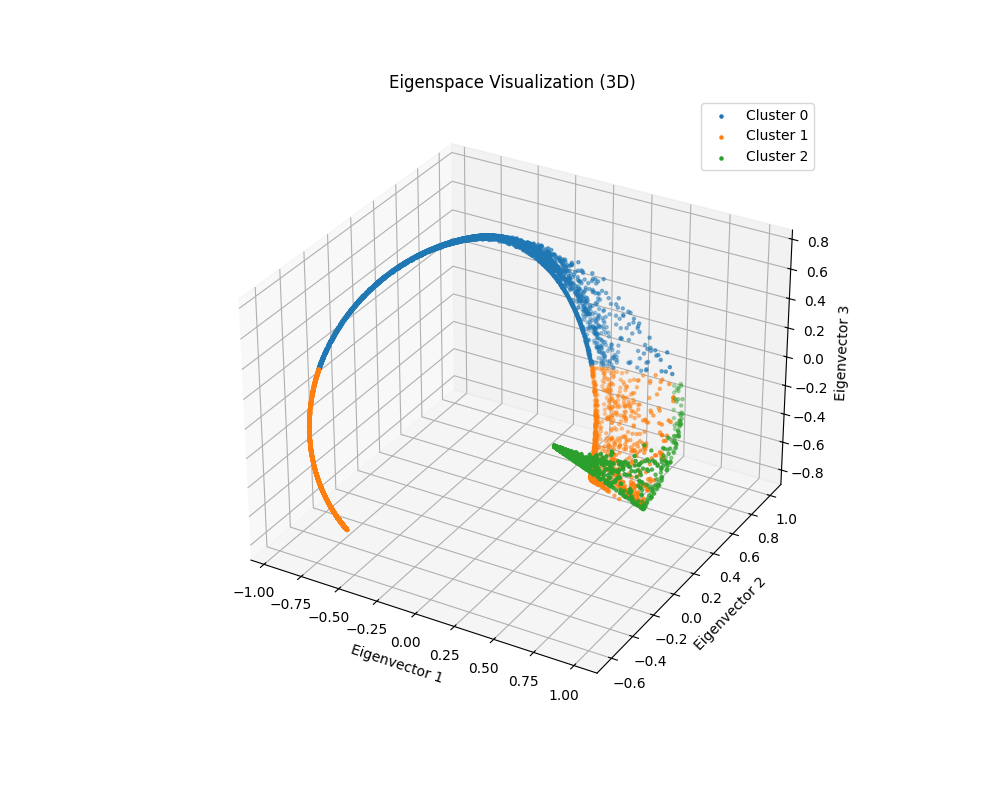 | 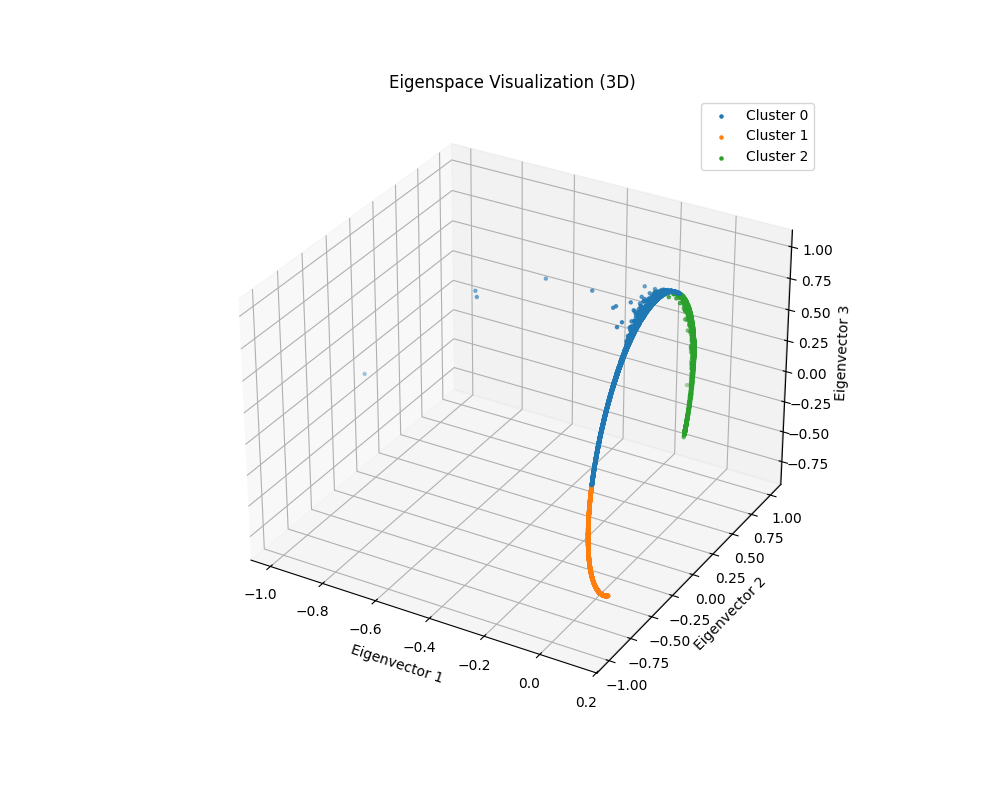 |

|            | spectral clustering (normalized)                                                    | spectral clustering (ratio)                                                    |
| ---------- | ----------------------------------------------------------------------------------- | ------------------------------------------------------------------------------ |
|            | kmeans++                                                                            | kmeans++                                                                       |
| 2 clusters | 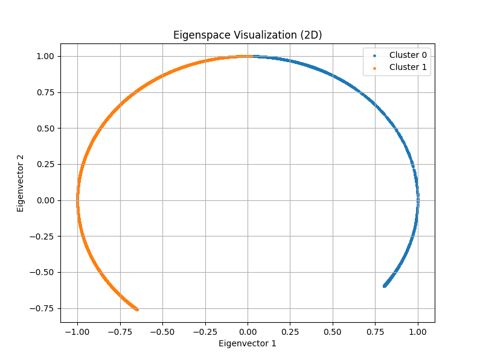 |  |
| 3 clusters | 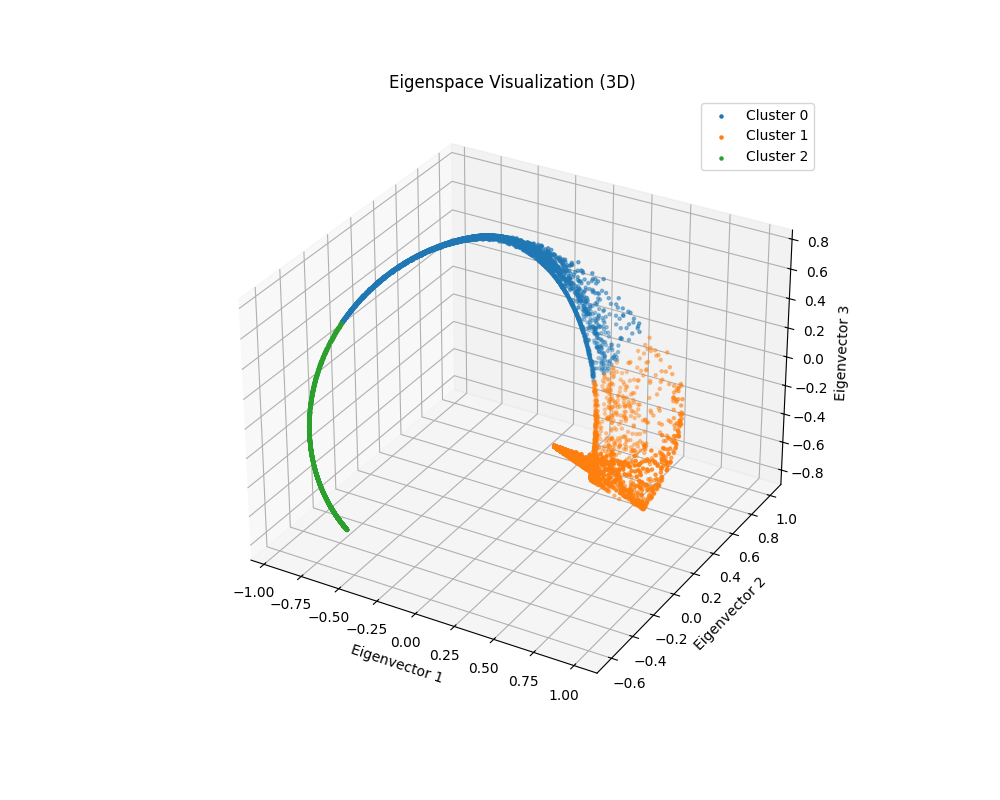 | 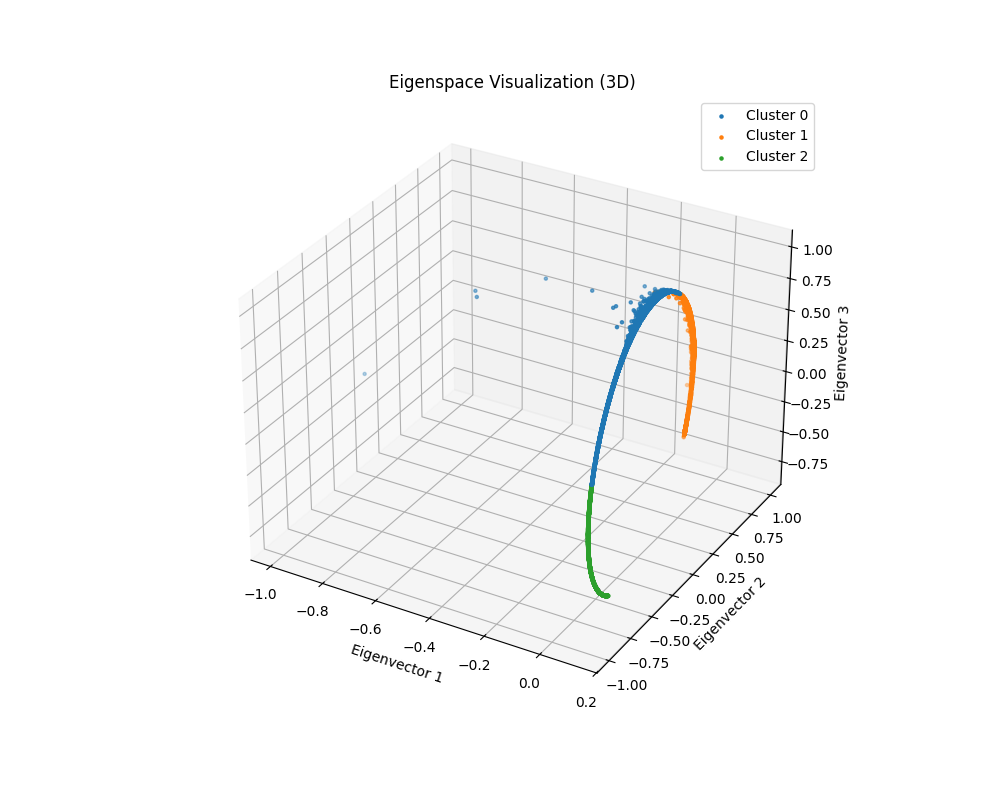 |

| Setting              | Normalized Laplacian                 | Ratio Laplacian                                |
| -------------------- | ------------------------------------ | ---------------------------------------------- |
| **2 Clusters**       | Arc-shaped, clean boundary           | Similar arc, more sensitive to init            |
| **3 Clusters**       | Hook-shaped 3D arc, moderate overlap | Good shape but less balanced w/ random         |
| **k-means++ Effect** | Refines boundaries, improves clarity | Dramatically improves compactness & separation |

- Image2’s spectral embeddings **form clear low-dimensional manifolds**.

- **Spectral Clustering (Ratio)** can match or exceed normalized performance when paired with **`k-means++`**.

- Choosing proper initialization is crucial when embeddings are **sparse or uneven**.
<div style="page-break-after: always;"></div>
## 3. Observations and discussion (20%)

### Compare the performance between different clustering methods. (8%)
#### image1

##### **2 Clusters**

**Random Initialization**

- **Kernel K-Means**: Clusters appear noisy, some irregularities near boundaries.
- **Spectral Clustering (Normalized/Ratio)**: Cleaner segmentation; objects are more clearly separated, especially the background and main object.
**K-Means++ Initialization**

- Improved consistency across all methods.

- **Spectral Clustering (Normalized)** maintains the most visually stable and coherent segmentation.

- **Kernel K-Means** becomes noticeably better, with reduced noise and clearer regions.

Spectral Clustering (especially normalized) effectively captures global structures even with just two clusters. `k-means++` helps eliminate instability from random starts.

---

##### **3 Clusters**

**Random Initialization**

- **Kernel K-Means**: More fragmentation observed. One region appears over-segmented.
- **Spectral Clustering (Normalized)**: Provides distinguishable separation of three regions.
- **Spectral Clustering (Ratio)**: Similar to normalized, though slightly less defined.

 **K-Means++ Initialization**

- Clear performance improvement in all methods.
- **Spectral Clustering (Normalized)** shows the sharpest boundaries and consistent cluster shapes.
- **Kernel K-Means** is more balanced than in the random case.

With more clusters, initialization plays a bigger role. Spectral Clustering retains robustness and interpretability.

---

##### **4 Clusters**

**Random Initialization**

- All methods show some fragmentation or over-segmentation.
- **Spectral (Normalized)** still outperforms the rest, though boundary clarity is slightly reduced.
- **Kernel K-Means** has the most scattered small regions.

**K-Means++ Initialization**

- **Spectral Clustering (Normalized)** shows a clear and meaningful 4-region split.
- **Spectral (Ratio)** is still acceptable but slightly noisier.
- **Kernel K-Means** improves compared to random, but cluster shapes are less smooth.

When the number of clusters increases, Spectral Clustering with normalization remains the most reliable. Kernel K-Means becomes less stable and more sensitive to initialization.

#### image2
##### **2 Clusters**

Random Initialization

- **Kernel K-Means**:

    - Clean split with large uniform regions.

    - Some subtle noise on boundaries.

- **Spectral Clustering (Normalized & Ratio)**:

    - More sensitive to edge textures and finer details.

    - Resulting segmentation includes scattered fragments.

    - Ratio method appears slightly smoother than normalized.

K-Means++ Initialization

- **Kernel K-Means**:

    - Still clean and consistent; slightly more balanced than with random.

- **Spectral Clustering**:

    - Still noisy in fine-textured regions, but more stable than random.
    - Both normalized and ratio produce very similar results.

Kernel K-Means is more spatially coherent under 2-cluster scenarios, while Spectral Clustering is more sensitive to local texture details. Initialization method does not heavily affect outcome at 2 clusters, but `k-means++` offers slightly cleaner results.

---

##### **3 Clusters**

Random Initialization
- **Kernel K-Means**:
    - Good separation of major areas, but some mixed boundaries.
- **Spectral Clustering**:
    - Segment boundaries align more with texture transitions.
    - Noticeable patchiness, especially in normalized version.


K-Means++ Initialization

- **Kernel K-Means**:

    - Reduced patch noise, better-defined cluster shapes.

- **Spectral Clustering**:

    - Less chaotic than random; smoother transitions.
    - Normalized and ratio still differ slightly in region compactness.

With more clusters, the effect of initialization becomes more noticeable. Spectral methods capture more nuanced structures but are prone to over-segmentation without proper tuning.

---

##### **4 Clusters**

Random Initialization

- **Kernel K-Means**:

    - Cluster regions look natural, but smaller details may be under-represented.

- **Spectral Clustering**:

    - Both normalized and ratio highlight very fine-grained structures.

    - More scattered pixel clusters, which might be undesirable for object-level segmentation.


K-Means++ Initialization

- **Kernel K-Means**:

    - Significantly improved — clearer separation and compact clusters.

- **Spectral Clustering**:

    - Ratio version becomes more structured and readable.

    - Normalized still prone to noise in textured regions, but better than random.

With higher cluster counts, `k-means++` is essential to stabilize the results. Spectral Clustering (Ratio) becomes more visually coherent than Normalized in high-cluster settings.

### Compare the execution time of different settings. (8%)

image1

|            | kernel  k-means method | spectral clustering (normalized) | spectral clustering (ratio) |
| ---------- | ---------------------- | -------------------------------- | --------------------------- |
|            | random                 | random                           | random                      |
| 2 clusters | 40.37 sec              | 312.72 sec                       | 173.45 sec                  |
| 3 clusters | 30.43 sec              | 176.54 sec                       | 200.60 sec                  |
| 4 clusters | 84.31 sec              | 209.88 sec                       | 197.34 sec                  |

|            | kernel  k-means method | spectral clustering (normalized) | spectral clustering (ratio) |
| ---------- | ---------------------- | -------------------------------- | --------------------------- |
|            | k-means++              | k-means++                        | k-means++                   |
| 2 clusters | 45.47 sec              | 208.94 sec                       | 150.79 sec                  |
| 3 clusters | 41.60 sec              | 210.32 sec                       | 173.40 sec                  |
| 4 clusters | 79.79 sec              | 218.64 sec                       | 152.71 sec                  |

Observations

1. **General Trends**

- **Kernel K-Means** is significantly faster across all settings.

- **Spectral Clustering (Normalized)** is the slowest method, particularly for `2 clusters` and `k-means++`.

- **Spectral Clustering (Ratio)** lies between the two in terms of runtime, generally faster than normalized but slower than kernel k-means.


2. **Effect of Initialization Method**

- **`k-means++` initialization** increases runtime slightly for **Kernel K-Means**, likely due to the additional computation of better-initialized centers.

- Surprisingly, for **Spectral Clustering**, `k-means++` slightly **reduces or stabilizes runtime** compared to random — likely because better initialization reduces k-means iterations after spectral embedding.


3. **Effect of Cluster Number**

- For all methods, increasing the number of clusters does **not always linearly increase runtime**.

    - **Kernel K-Means**: runtime fluctuates, e.g., `3 clusters` takes **less time** than `2 clusters` in the `random` setting — likely due to early convergence.

    - **Spectral Clustering (Normalized)**: runtime increases with more clusters, especially in `k-means++`.

    - **Spectral Clustering (Ratio)**: similar pattern but with smaller increases.


---


- **Kernel K-Means** is clearly the most efficient method, making it suitable for time-sensitive applications or larger images.

- **Spectral Clustering** methods, while slower, may offer better segmentation quality — a trade-off between accuracy and speed.

- Choosing `k-means++` may slightly increase cost for Kernel K-Means but improves convergence in Spectral Clustering.

- **Spectral Clustering (Ratio)** provides a good middle ground in terms of both **runtime** and **segmentation smoothness**.

image2

|            | kernel  k-means method | spectral clustering (normalized) | spectral clustering (ratio) |
| ---------- | ---------------------- | -------------------------------- | --------------------------- |
|            | random                 | random                           | random                      |
| 2 clusters | 19.10 sec              | 203.68 sec                       | 176.47 sec                  |
| 3 clusters | 19.68 sec              | 206.87 sec                       | 153.53 sec                  |
| 4 clusters | 20.88 sec              | 207.15 sec                       | 164.27                      |


|            | kernel  k-means method | spectral clustering (normalized) | spectral clustering (ratio) |
| ---------- | ---------------------- | -------------------------------- | --------------------------- |
|            | k-means++              | k-means++                        | k-means++                   |
| 2 clusters | 15.05 sec              | 209.93sec                        | 166.47 sec                  |
| 3 clusters | 44.16 sec              | 196.51 sec                       | 167.22 sec                  |
| 4 clusters | 36.29 sec              | 196.04 sec                       | 170.13 sec                  |

Observations

1. **Overall Performance**

- **Kernel K-Means** is significantly faster than both spectral clustering variants in all configurations.

- **Spectral Clustering (Normalized)** has the highest runtime consistently (~196–210 seconds).

- **Spectral Clustering (Ratio)** performs slightly faster than normalized in most settings, especially under `random`.


---

2. **Effect of Initialization Method**

#### Kernel K-Means:

- **Unusual behavior**:

    - `k-means++` is **faster** than `random` in `2 clusters`, but **slower** for `3 and 4 clusters`.

    - This may be due to variability in early convergence behavior depending on initialization.


#### Spectral Clustering:

- The choice between `random` and `k-means++` **has minimal impact** on execution time.

    - This is expected, since most of the time is spent computing the Laplacian and its eigenvectors, not in k-means.


---

3. **Effect of Cluster Number**

#### Kernel K-Means:

- Runtime increases slightly with more clusters under `random`.

- Under `k-means++`, runtime spikes for `3 clusters` (44.16 sec) and drops again for `4 clusters` — possibly due to convergence complexity at `k=3`.


#### Spectral Clustering:

- Both **Normalized** and **Ratio** variants maintain **stable runtime** across different cluster numbers.

- This shows that the **eigen-decomposition dominates** runtime and is not strongly affected by `k`.


---

- **Kernel K-Means** is extremely efficient on Image2, completing most runs under **45 seconds**.

- **Spectral Clustering** is significantly slower, taking **~3 to 10× longer**, regardless of initialization or cluster count.

- **Spectral (Ratio)** remains a viable trade-off between runtime and structure-aware segmentation.

- `k-means++` helps Kernel K-Means only in specific settings; for spectral methods, it has **negligible effect on time**.

### Anything you want to discuss. (4%)


|            | kernel  k-means method | spectral clustering (normalized) | spectral clustering (ratio) |
| ---------- | ---------------------- | -------------------------------- | --------------------------- |
|            | random                 | random                           | random                      |
| 2 clusters | 15                     | 4                                | 4                           |
| 3 clusters | 11                     | 9                                | 23                          |
| 4 clusters | 38                     | 12                               | 19                          |


|            | kernel  k-means method | spectral clustering (normalized) | spectral clustering (ratio) |
| ---------- | ---------------------- | -------------------------------- | --------------------------- |
|            | k-means++              | k-means++                        | k-means++                   |
| 2 clusters | 22                     | 4                                | 4                           |
| 3 clusters | 14                     | 12                               | 2                           |
| 4 clusters | 33                     | 7                                | 4                           |

- **Spectral Clustering** (both normalized and ratio) consistently converges **much faster** (mostly within 2–12 iterations) than **Kernel K-Means**, which often requires **10–40+ iterations**.

- **Normalized Spectral Clustering** is especially stable and predictable, showing **almost constant convergence** around 4–12 iterations regardless of `k`.

- **Kernel K-Means** is **more sensitive** to:

    - the number of clusters (`k`)

    - the initialization method (`k-means++` generally helps but not always)

---

image2

|            | kernel  k-means method | spectral clustering (normalized) | spectral clustering (ratio) |
| ---------- | ---------------------- | -------------------------------- | --------------------------- |
|            | random                 | random                           | random                      |
| 2 clusters | 11                     | 8                                | 3                           |
| 3 clusters | 13                     | 13                               | 9                           |
| 4 clusters | 17                     | 20                               | 62                          |


|            | kernel  k-means method | spectral clustering (normalized) | spectral clustering (ratio) |
| ---------- | ---------------------- | -------------------------------- | --------------------------- |
|            | k-means++              | k-means++                        | k-means++                   |
| 2 clusters | 8                      | 21                               | 2                           |
| 3 clusters | 41                     | 9                                | 8                           |
| 4 clusters | 34                     | 10                               | 10                          |

- **Spectral Clustering (Ratio)** shows **extreme sensitivity** to cluster number and initialization:

    - It converges **very quickly** in some cases (e.g., 2 clusters, `k-means++`: 2 iterations),

    - But can take **very long** in others (e.g., 4 clusters, `random`: 62 iterations).

- **Spectral Clustering (Normalized)** is generally more **stable** in convergence speed, mostly staying below 20 iterations.

- **Kernel K-Means** remains **variable**:

    - `k-means++` sometimes reduces iterations (e.g., 2 clusters: from 11 → 8),

    - But may also **increase** iteration count unexpectedly (e.g., 3 clusters: 13 → 41).
