# A. Kernel Eigenfaces
## 1. Code with detailed explanations
### Part 1

#### Principal Component Analysis (PCA)
```python
def pca(X, n_components):
    mean_vector = np.mean(X, axis=0, keepdims=True)
    X_centered = X - mean_vector
    cov_small = X_centered @ X_centered.T / (X.shape[1] - 1)
    vals, vecs = np.linalg.eigh(cov_small)
    sorted_indices = np.argsort(vals)[::-1]
    vecs = vecs[:, sorted_indices]
    components = X_centered.T @ vecs
    components = components[:, :n_components]
    norms = np.linalg.norm(components, axis=0, keepdims=True)
    components = components / norms
    return components, mean_vector

```

Reduce the dimensionality of data while preserving as much variance as possible.

1. Center the data :Subtract the mean vector from each data point so the data has zero mean.
2. Compute the small covariance matrix ：When n_samples < n_features, compute:  $C = \frac{1}{d - 1} XX^T$
3. Eigen decomposition：Solve the eigenvalue problem:    $C \vec{v} = \lambda \vec{v}$
4. Sort eigenvectors by eigenvalues (descending)
5. Project back to original space
6. Normalize the components

---

#### Linear Discriminant Analysis (LDA)
```python
def lda(X, y, num_components):
    class_labels = list(set(y))
    mean_total = np.mean(X, axis=0)
    Sw, Sb = np.zeros((X.shape[1], X.shape[1])), np.zeros((X.shape[1], X.shape[1]))
    for c in class_labels:
        X_c = X[np.array(y) == c]
        mean_c = np.mean(X_c, axis=0)
        Sw += (X_c - mean_c).T @ (X_c - mean_c)
        n_c = X_c.shape[0]
        mean_diff = (mean_c - mean_total).reshape(-1, 1)
        Sb += n_c * mean_diff @ mean_diff.T
    eigvals, eigvecs = np.linalg.eig(np.linalg.pinv(Sw) @ Sb)
    idx = np.argsort(-np.abs(eigvals))[:num_components]
    return eigvecs[:, idx].real

```

Find a linear projection that **maximizes class separability** by maximizing the ratio of between-class scatter to within-class scatter.

- Steps (Mathematical Formulation)
- 

1. **Compute the global mean vector**:

   $$
   \mathbf{m} = \frac{1}{n} \sum_{i=1}^n \mathbf{x}_i
   $$

2. **Compute class-wise mean vectors**:

   $$
   \mathbf{m}_j = \frac{1}{n_j} \sum_{i \in C_j} \mathbf{x}_i, \quad j = 1, \dots, k
   $$

3. **Compute within-class scatter matrix**:

   $$
   S_W = \sum_{j=1}^k S_j, \quad \text{where } S_j = \sum_{i \in C_j} (\mathbf{x}_i - \mathbf{m}_j)(\mathbf{x}_i - \mathbf{m}_j)^T
   $$

4. **Compute between-class scatter matrix**:

   $$
   S_B = \sum_{j=1}^k n_j (\mathbf{m}_j - \mathbf{m})(\mathbf{m}_j - \mathbf{m})^T
   $$

5. **Solve the generalized eigenvalue problem**:

   $$
   S_W^{-1} S_B \mathbf{w} = \lambda \mathbf{w}
   $$

6. **Sort eigenvectors and select top components**:
   - Rank eigenvalues: $\lambda_1 \geq \lambda_2 \geq \cdots$
   - Select top \( d \) eigenvectors to form projection matrix:
   $$
   W = [\mathbf{w}_1, \dots, \mathbf{w}_d]
   $$


---
#### Visualizing Eigenfaces and Fisherfaces using PCA and LDA

- Display the **first 25 eigenfaces** and **first 25 fisherfaces**.
- Randomly select **10 training images** to reconstruct using PCA and LDA.
1. **Apply PCA to training images:**

```python
W_pca, X_mean = pca(X_train, n_components=25)
show_eigenfaces(W_pca, h, w, title="First 25 eigenfaces")`
```

2. **Reconstruct 10 random training images using PCA:**
```python
Z_train_pca = (X_train - X_mean) @ W_pca
X_train_rec = Z_train_pca @ W_pca.T + X_mean show_reconstruction(X_train, X_train_rec, h, w, fnames_train, title="10 reconstructed images from PCA")
```

3. **Compute Fisherfaces via PCA → LDA pipeline:**

```python
X_train_pca_50 = (X_train - X_mean) @ W_pca[:, :50] W_lda = lda(X_train_pca_50, y_train, n_components=25) fisherfaces = W_pca[:, :50] @ W_lda show_eigenfaces(fisherfaces, h, w, title="First 25 fisherfaces")
```

4. **Reconstruct images using LDA:**
```python
Z_train_lda = X_train_pca_50 @ W_lda X_train_rec_lda = Z_train_lda @ W_lda.T @ W_pca[:, :50].T + X_mean show_reconstruction(X_train, X_train_rec_lda, h, w, fnames_train, title="10 reconstructed images from LDA")`
```

---

### Part 2: Face Recognition using PCA / LDA + k-NN

- Perform face recognition using PCA and LDA features.
- Evaluate performance using **k-NN** classifier for different values of `k`.

1. **Project test images to PCA and LDA spaces:**
```python
Z_test_pca = (X_test - X_mean) @ W_pca X_test_pca_50 = (X_test - X_mean) @ W_pca[:, :50] Z_train_lda = X_train_pca_50 @ W_lda Z_test_lda = X_test_pca_50 @ W_lda
```

2. **Perform k-NN classification and cross-validation:**
```python
best_k_pca, best_k_lda, df_result = run_part2_with_cv(     Z_train_pca, Z_test_pca, Z_train_lda, Z_test_lda, y_train, y_test ) save_accuracy_table_as_image(df_result)`
```

---

### Part 3: Face Recognition using Kernel PCA and Kernel LDA

#### kernel_pca
```python
def kernel_pca(X, n_components, kernel='rbf', gamma=0.001, degree=3):
    N = X.shape[0]
    if kernel == 'rbf':
        pairwise_sq_dists = compute_pairwise_sq_dists(X)
        K = np.exp(-gamma * pairwise_sq_dists)
    elif kernel == 'poly':
        K = (X @ X.T + 1) ** degree
    else:
        raise ValueError("Unsupported kernel")

    one_n = np.ones((N, N)) / N
    K_centered = K - one_n @ K - K @ one_n + one_n @ K @ one_n
    eigvals, eigvecs = np.linalg.eigh(K_centered)
    idx = np.argsort(eigvals)[::-1]
    eigvals, eigvecs = eigvals[idx], eigvecs[:, idx]
    alphas = eigvecs[:, :n_components]
    lambdas = eigvals[:n_components]
    alphas = alphas / np.sqrt(lambdas + 1e-10)
    return K_centered, alphas
```

Perform non-linear dimensionality reduction using the Kernel PCA method.

1. Compute the kernel (Gram) matrix K:
   - If 'rbf' kernel:
     $$ K_{ij} = \exp(-\gamma \|x_i - x_j\|^2) $$
   - If 'poly' kernel:
     $$ K_{ij} = (x_i^\top x_j + 1)^{\text{degree}} $$

2. Center the kernel matrix:
   $$ K_c = K - \mathbf{1}_N K - K \mathbf{1}_N + \mathbf{1}_N K \mathbf{1}_N $$

3. Eigen decomposition of the centered kernel matrix:
   $$ K_c \alpha = \lambda \alpha $$

4. Sort eigenvalues and select top n eigenvectors.

5. Normalize eigenvectors (alphas):
   $$ \alpha_i = \frac{\alpha_i}{\sqrt{\lambda_i}} $$

6. Return the centered kernel and normalized projections.

#### kernel_lda


```python
def kernel_lda(X, y, n_components, kernel='rbf', gamma=0.001, degree=3):
    N = X.shape[0]
    classes = list(set(y))
    y = np.array(y)
    if kernel == 'rbf':
        pairwise_sq_dists = compute_pairwise_sq_dists(X)
        K = np.exp(-gamma * pairwise_sq_dists)
    elif kernel == 'poly':
        K = (X @ X.T + 1) ** degree
    else:
        raise ValueError("Unsupported kernel")
    one_n = np.ones((N, N)) / N
    K_centered = K - one_n @ K - K @ one_n + one_n @ K @ one_n

    N_c, M = [], []
    for cls in classes:
        idx = np.where(y == cls)[0]
        N_c.append(len(idx))
        K_c = K_centered[:, idx]
        M.append(np.mean(K_c, axis=1, keepdims=True))
    M = np.hstack(M)
    total_mean = np.mean(K_centered, axis=1, keepdims=True)

    Sb, Sw = np.zeros((N, N)), np.zeros((N, N))
    for i in range(len(classes)):
        mean_diff = M[:, [i]] - total_mean
        Sb += N_c[i] * (mean_diff @ mean_diff.T)
        idx = np.where(y == classes[i])[0]
        for j in idx:
            diff = K_centered[:, [j]] - M[:, [i]]
            Sw += diff @ diff.T

    eigvals, eigvecs = np.linalg.eig(np.linalg.pinv(Sw + 1e-6 * np.eye(N)) @ Sb)
    idx = np.argsort(-np.abs(eigvals))
    eigvecs = eigvecs[:, idx[:n_components]]
    return (K_centered @ eigvecs).real
```


Perform **Kernel Linear Discriminant Analysis (KLDA)** to maximize class separability in a **non-linear feature space** using kernel functions.

1. **Compute the kernel matrix**:

   $$
   K_{ij} = k(\mathbf{x}_i, \mathbf{x}_j)
   $$

   where \( k(\cdot, \cdot) \) is a kernel function (e.g., RBF, polynomial).

2. **Center the kernel matrix**:

   $$
   \tilde{K} = K - \mathbf{1}_n K - K \mathbf{1}_n + \mathbf{1}_n K \mathbf{1}_n
   $$

   where \( \mathbf{1}_n = \frac{1}{n} \mathbf{1} \mathbf{1}^\top \) is the centering matrix.

3. **Compute class-wise mean vectors in RKHS**:

   $$
   \mathbf{m}_j = \frac{1}{n_j} \sum_{i \in C_j} \tilde{K}_{:, i}
   $$

4. **Compute scatter matrices in RKHS**:

   - **Between-class scatter**:

     $$
     S_B = \sum_{j=1}^k n_j (\mathbf{m}_j - \mathbf{m})(\mathbf{m}_j - \mathbf{m})^T
     $$

   - **Within-class scatter**:

     $$
     S_W = \sum_{j=1}^k \sum_{i \in C_j} (\tilde{K}_{:, i} - \mathbf{m}_j)(\tilde{K}_{:, i} - \mathbf{m}_j)^T
     $$

   where \( \mathbf{m} = \frac{1}{n} \sum_{i=1}^n \tilde{K}_{:, i} \) is the global mean in RKHS.

5. **Solve the generalized eigenvalue problem**:

   $$
   (S_W + \varepsilon I)^{-1} S_B \mathbf{v} = \lambda \mathbf{v}
   $$

   where \( \varepsilon I \) is a regularization term to ensure numerical stability.

6. **Project data in the kernel space** using top \( d \) eigenvectors:

   $$
   \mathbf{Z} = \tilde{K} \mathbf{V}_d
   $$

   where \( \mathbf{V}_d = [\mathbf{v}_1, \dots, \mathbf{v}_d] \) are the selected top eigenvectors.


#### kernel_project

```python
def kernel_project(X_train, X_test, alphas, kernel='rbf', gamma=0.001, degree=3):
    if kernel == 'rbf':
        pairwise_sq = compute_cdist(X_test, X_train) ** 2
        K_test = np.exp(-gamma * pairwise_sq)
    elif kernel == 'poly':
        K_test = (X_test @ X_train.T + 1) ** degree
    else:
        raise ValueError("Unsupported kernel")
    return K_test @ alphas
```

Project test data into the learned kernel space using the same kernel as training.
1. Compute the test kernel matrix:
   - RBF kernel:
     $$ K_{ij} = \exp(-\gamma \|x_i - x_j\|^2) $$
   - Polynomial kernel:
     $$ K_{ij} = (x_i^\top x_j + 1)^{\text{degree}} $$

2. Project the test points:
   $$ Z_{\text{test}} = K_{\text{test}} \cdot \alpha $$

- Apply **Kernel PCA** and **Kernel LDA** to capture nonlinear structure.
- Try **linear**, **polynomial**, and **RBF** kernels
- Compare with standard PCA/LDA in terms of accuracy.

1. **Apply Kernel PCA with RBF kernel:**
```python
`_, alpha_kpca = kernel_pca(X_train, n_components=25, kernel='rbf', gamma=0.001) Z_train_kpca = alpha_kpca Z_test_kpca = kernel_project(X_train, X_test, alpha_kpca, kernel='rbf', gamma=0.001) acc_kpca = knn_classifier(Z_train_kpca, y_train, Z_test_kpca, y_test, k=3)`
```

2. **Apply Kernel LDA with RBF kernel:**
```python
Z_train_klda = kernel_lda(X_train, y_train, n_components=25, kernel='rbf', gamma=0.001) Z_test_klda = kernel_project(X_train, X_test, Z_train_klda, kernel='rbf', gamma=0.001) acc_klda = knn_classifier(Z_train_klda, y_train, Z_test_klda, y_test, k=3)`
```
3. **Compare different kernel performances:**
```python
df_kernel_result = evaluate_kernel_methods( X_train, X_test, y_train, y_test, n_components=25, k_list=[1, 3, 5, 7, 9] ) save_kernel_accuracy_tables(df_kernel_result)`
```
## 2. Experiments and Discussion
### Part 1
#### First 25 eigenfaces:
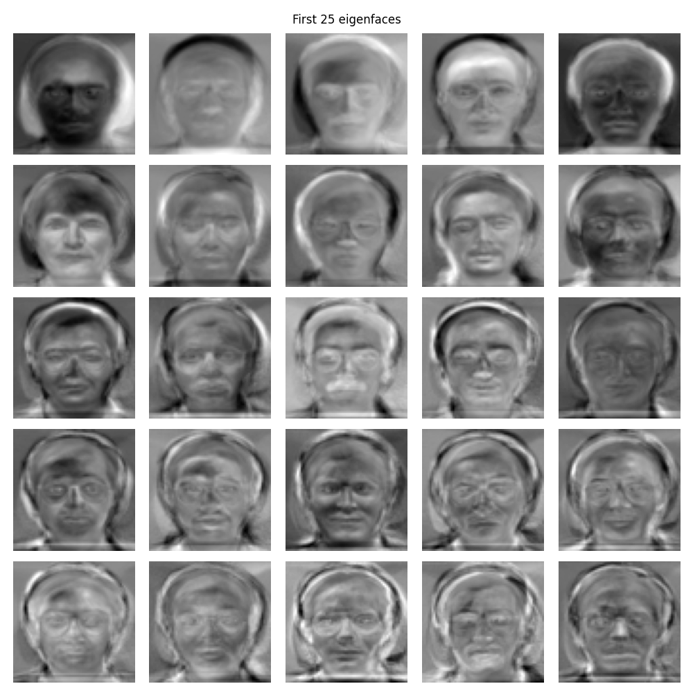
These eigenfaces represent the principal components learned from the training data by PCA. Each one encodes directions of maximum variance in the data.
#### First 25 fisherfaces:
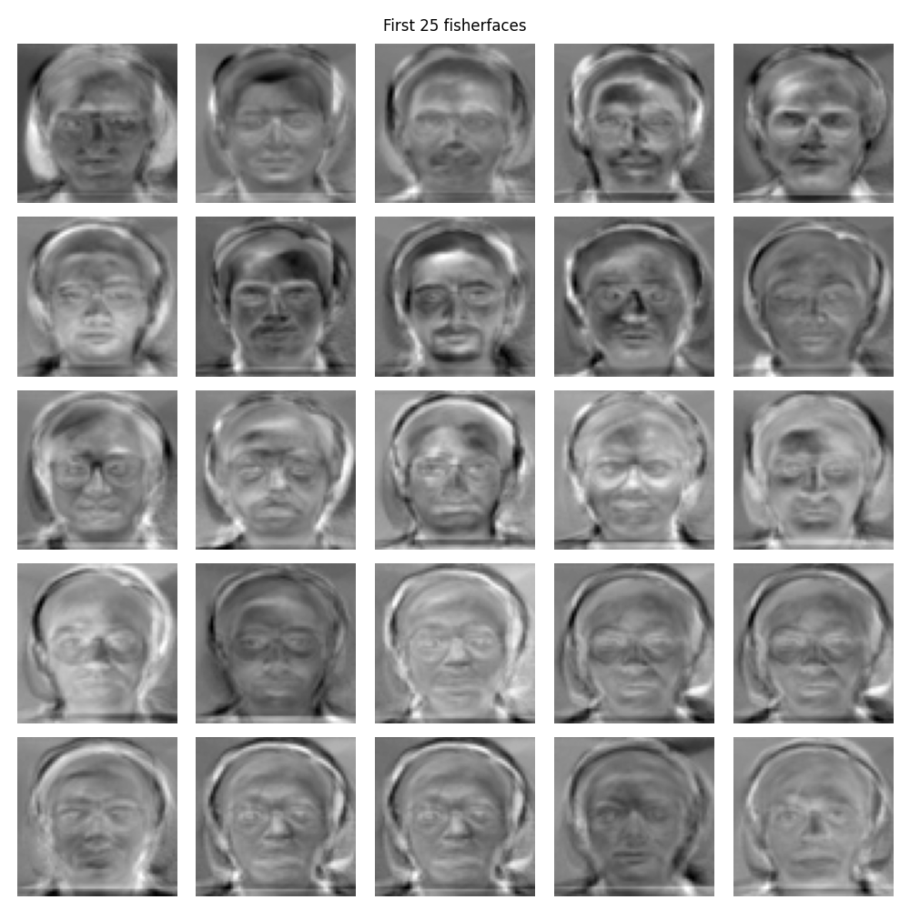
Fisherfaces are obtained by applying LDA after projecting data to PCA subspace (to ensure within-class scatter matrix is non-singular). They maximize class separability.
#### 10 reconstructed images from PCA:
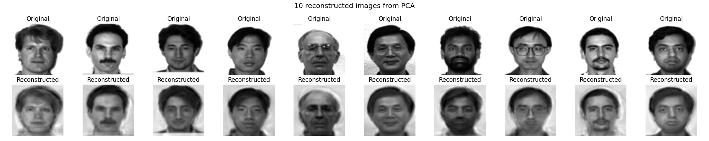
The original images (top) and their PCA reconstructions (bottom). PCA preserves general facial structure well due to capturing major variance directions.
#### 10 reconstructed images from LDA:
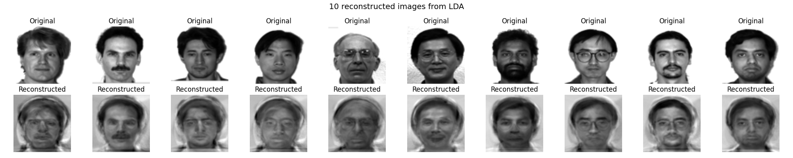
LDA reconstructions (bottom) are generally more blurred and class-average-like due to fewer available discriminative directions (at most $C - 1$, where $C = 40$).
#### Discussion

- **PCA vs. LDA**:

    - **PCA** focuses on retaining global variance, leading to better reconstruction of individual face details.
    - **LDA** aims at maximizing inter-class separability, so its reconstruction is less precise but more class-discriminative.

- **Visualization**:

    - Eigenfaces resemble shadows of typical face structures capturing lighting and pose variance.
    - Fisherfaces highlight discriminative features between subjects (e.g., glasses, face shapes).

- **Limitation**:

    - LDA is constrained by number of classes (maximum $C - 1 = 39$ components).
    - PCA lacks class information, which can reduce performance in classification tasks.

### Part 2
The hyperparameter k represents the number of nearest neighbors to be selected.
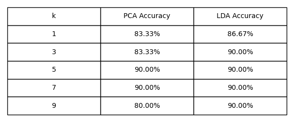
#### Discussion

- **Performance Comparison**:

    - LDA consistently outperformed PCA across all tested $k$ values, showing stronger class separability.

    - PCA reached its highest accuracy (90%) at $k=5$ and $k=7$, but performance dropped at $k=9$, possibly due to over-smoothing effects.

    - LDA remained stable at 90% or higher, with peak accuracy at $k=3$.

- **Insights**:

    - PCA captures global variance without considering class labels, which may lead to suboptimal recognition performance.

    - LDA focuses on maximizing inter-class variance and minimizing intra-class variance, which enhances its classification power.

    - LDA benefits more from a moderate $k$ (like $k=3$), while PCA performs best with a small-to-mid $k$ due to noise sensitivity.
### Part 3   (3%)
part3_lda_kernel_accuracy

part3_pca_kernel_accuracy
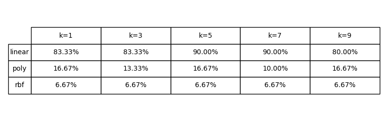
k-Nearest Neighbors (Euclidean distance in the projected space)
- Tested $k = 1, 3, 5, 7, 9$
#####  Discussion

#### 1. Kernel vs. Non-Kernel Methods

- **Kernel LDA (with linear kernel)** achieved up to **96.67%** accuracy across several values of $k$, slightly higher than the best performance of **simple LDA** (93.33% at $k=3$). This shows that the kernelized version of LDA can enhance performance modestly in linearly separable settings.

- **Kernel PCA (linear kernel)** showed very similar results to **simple PCA**, achieving a maximum accuracy of **90.00%** at $k=5$ and $k=7$, indicating that linear projection is already sufficient for this dataset.


 **Conclusion**: Kernelization slightly improves LDA but brings no additional benefit to PCA in this task.

---

#### 2. Impact of Kernel Choice

- The **linear kernel** consistently outperformed the other kernels:

    - **Kernel LDA** (linear): ≥93.33% across all kkk

    - **Kernel PCA** (linear): up to 90.00%

- Both **polynomial** and **RBF kernels** performed **very poorly** (≤16.67%) for both PCA and LDA. Possible reasons include:

    - Severe overfitting in high-dimensional kernel space

    - Inappropriate hyperparameter choices (e.g., $\gamma$, degree $d$)

    - Limited training samples not sufficient for complex nonlinear mappings


**Conclusion**: The dataset is likely linearly separable, and nonlinear kernels are not suitable in this context without careful tuning.

---

#### 3. Effect of $k$ in k-NN

- **Kernel LDA (linear)**:

    - Accuracy remained stable at **96.67%** for $k=1, 5, 7, 9$

    - Robust to the choice of kkk

- **Kernel PCA (linear)**:

    - Accuracy peaked at **90.00%** for $k=5$ and $k=7$

    - Decreased to **80.00%** at $k=9$, indicating sensitivity to $k$


**Conclusion**: LDA-based projections are more robust to changes in $k$, while PCA-based projections are more sensitive and require careful $k$-selection.

### (5%) Please discuss the observation in this part (You can  compare the result with PCA/LDA)
Summary: PCA/LDA vs. Kernel PCA/LDA

| Method                           | Best Accuracy | Stability Across k | Key Observation                                                      |
| -------------------------------- | ------------- | ------------------ | -------------------------------------------------------------------- |
| **PCA (simple)**                 | 90.00%        | Moderate           | Captures variance, unsupervised, sensitive to kk                     |
| **LDA (simple)**                 | 93.33%        | High               | Supervised; good class separability                                  |
| **Kernel PCA (linear)**          | 90.00%        | Moderate           | Performs similarly to PCA; no advantage shown                        |
| **Kernel LDA (linear)**          | 96.67%        | Very High          | Best performance; consistent across all kk values                    |
| **Kernel PCA/LDA (poly or RBF)** | ≤16.67%       | Very Low           | Poor performance; likely due to bad kernel parameters or overfitting |

#### Key Observations:

1. **Linear Kernel is Most Effective**:
    Both Kernel PCA and Kernel LDA with a linear kernel performed the best among all methods. In particular, Kernel LDA (linear) achieved **96.67%**, outperforming simple LDA (93.33%) by a small but consistent margin.

2. **Nonlinear Kernels Performed Poorly**:
    Polynomial and RBF kernels yielded extremely low accuracy (≤16.67%) in both PCA and LDA settings. This suggests that either:

    - The data is already linearly separable,
    - The kernel parameters (like $\gamma$, degree $d$) were not well-tuned,
    - Or the dataset size is insufficient to train complex kernel models reliably.

3. **Supervised LDA Methods Are More Robust**:
    Compared to PCA, LDA-based methods (both simple and kernel) are more robust across different $k$values in k-NN and better leverage class-label information.

4. **Kernelization Helps LDA More Than PCA**:
    Kernel LDA (linear) showed noticeable improvement over simple LDA, but Kernel PCA did not show improvement over simple PCA. This indicates that the kernel trick is more beneficial when combined with a supervised dimensionality reduction method.

# B. t-SNE
## 1. Code with detailed explanations

### Part 1

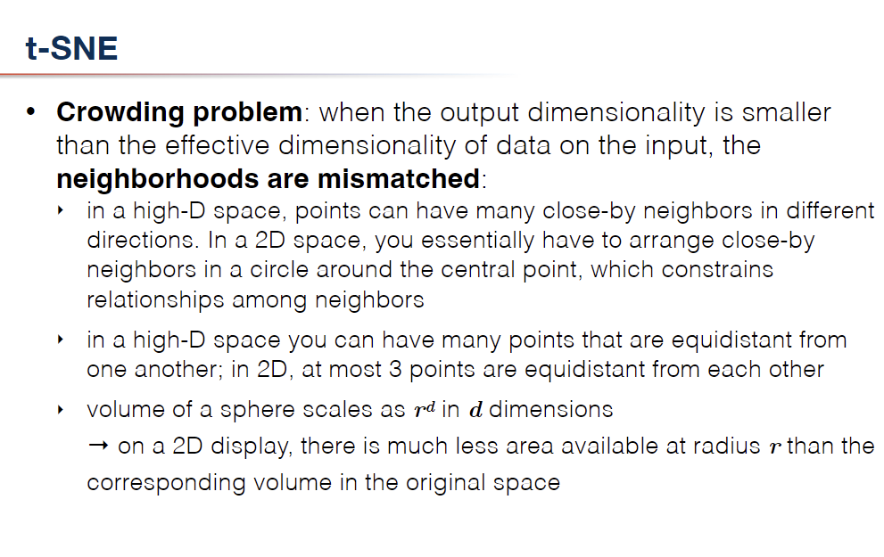
#### Symmetric SNE vs. t-SNE / Crowding Problem

In **dimensionality reduction**, especially from high-D to 2D or 3D space, we encounter the **crowding problem**: When projecting high-dimensional data to low dimensions, it's hard to preserve all pairwise distances due to the limited space. Nearby points in high-D space cannot all be placed close to each other in low-D, leading to **neighborhood mismatch**.

#### Modifying t-SNE to Symmetric SNE

In **t-SNE**, the **Student-t distribution** (with one degree of freedom) is used in the low-dimensional space to **alleviate the crowding problem**, thanks to its **heavy tails**. This allows moderate- or far-apart points in high-D space to stay far apart in low-D space.

To switch to **symmetric SNE**, we modify the low-D similarity computation:

```python
# Compute pairwise affinities
sum_Y = np.sum(np.square(Y), 1)
num = -2. * np.dot(Y, Y.T)

if symmetric_sne:
    num = np.exp(-np.add(np.add(num, sum_Y).T, sum_Y))  # Gaussian kernel (symmetric SNE)
else:
    num = 1. / (1. + np.add(np.add(num, sum_Y).T, sum_Y))  # Student-t kernel (t-SNE)

num[range(n), range(n)] = 0.
Q = num / np.sum(num)
Q = np.maximum(Q, 1e-12)
```

| Method            | Kernel in Low-D        | Effect on Crowding Problem                            | Remarks                           |
| ----------------- | ---------------------- | ----------------------------------------------------- | --------------------------------- |
| **t-SNE**         | Student-t (heavy tail) | **Reduces** crowding via long-range attraction        | More robust to high-D geometry    |
| **Symmetric SNE** | Gaussian               | **Worsens** crowding — Gaussian shrinks neighborhoods | Simpler, but less effective in 2D |

Therefore, **t-SNE is preferred** for 2D/3D visualization because its **Student-t kernel combats the crowding effect**, which is fundamental when preserving meaningful neighborhood structures.
### Part 2
The final projections are created using:
```python
for label in np.unique(labels):
    idx = labels == label
    plt.scatter(Y[idx, 0], Y[idx, 1], s=10, label=str(int(label)))
plt.title(f"{method.upper()} projection\nperplexity={perplexity}, iter=500")
plt.axis("off")
plt.tight_layout()
plt.savefig(os.path.join(output_dir, f"{method}_perplexity_{perplexity}.png"))
```
The **optimization procedure** is visualized as GIF using the function `create_animation(...)`:
```python
create_animation(Y_frames, labels, filename, symmetric_sne)

```
This function internally plots every 10th iteration stored in `Y_frames`:
```python
for i, Y in enumerate(Y_frames):
    ...
    ax.set_title(f'Iteration {(i + 1) * 10}')
    ...
    frame = np.array(fig.canvas.renderer.buffer_rgba())
    frames.append(frame[:,:,:3])
imageio.v2.mimsave(gif_path, frames, loop=1, fps=5)

```

Hyperparameters:
```python
no_dims = 2
initial_dims = 50
max_iter = 500
perplexity = [10, 20, 50, 100]
```


### Part 3
Pairwise similarity histograms in **high-dimensional space (P)** and **low-dimensional space (Q)** are generated using:
```python
plot_pairwise_similarity_distribution(P, Q, method, perplexity)
```
Where:
```python
P = x2p(X, perplexity=perplexity)
P = (P + P.T) / np.sum(P + P.T)

sum_Y = np.sum(np.square(Y), axis=1)
if symmetric_sne:
    num = np.exp(-np.add(np.add(-2. * np.dot(Y, Y.T), sum_Y).T, sum_Y))
else:
    num = 1. / (1. + np.add(np.add(-2. * np.dot(Y, Y.T), sum_Y).T, sum_Y))

np.fill_diagonal(num, 0)
Q = num / np.sum(num)
Q = np.maximum(Q, 1e-12)

```
Then in the plotting function:
```python
plt.subplot(1, 2, 1)
plt.hist(P.flatten(), bins=35, log=True, density=True)
plt.title(f"{method} High-dimensional space (P) with perplexity ", fontsize=12)

plt.subplot(1, 2, 2)
plt.hist(Q.flatten(), bins=35, log=True, density=True)
plt.title(f"{method} Low-dimensional space (Q)", fontsize=12)

```
This visualizes how pairwise similarity distributions differ between input and output spaces, with log-scale histograms.
### Part 4
The following loop controls the experimentation of **different perplexity values** for both t-SNE and symmetric SNE:
```python
perplexities = [10, 20, 50, 100]
for perplexity in perplexities:
    for method, symmetric_sne in [("tsne", False), ("symmetric_sne", True)]:
        Y, Y_frames = tsne(X, 2, 50, perplexity, symmetric_sne=symmetric_sne)
        create_animation(Y_frames, labels, filename, symmetric_sne)
        ...
```
Each combination outputs:

- The final 2D projection (`.png`)
- Optimization progress (`.gif`)
- Similarity distribution (`.png`)
## 2. Experiments and Discussion

### Part 1

|                      | t-SNE                                                  | Symmetric SNE                           |
| -------------------- | ------------------------------------------------------ | --------------------------------------- |
| Low-dim Similarity Q | Student-t distribution with 1 degree of freedom        | Gaussian kernel                         |
| Gradient Effect      | Heavy tail relaxes constraint in 2D, prevents crowding | Sharp decay leads to _crowding problem_ |
| Cluster Separation   | More distinct clusters                                 | Overlapping dense clusters              |
The **crowding problem** occurs because the 2D space cannot preserve intermediate distances well when using a Gaussian kernel, resulting in visually compact, overlapping embeddings.
### Part 2
- Initial dimensionality: 50 (via PCA)
- Final embedding dimensionality: 2
- Perplexity: 50
- Iteration: 500

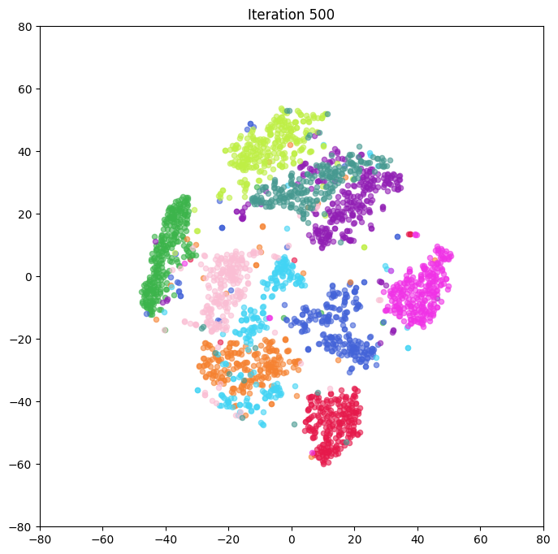
- **t-SNE**: Clearer separation between clusters. Most digit classes form tight, well-separated groups in the low-dimensional space.

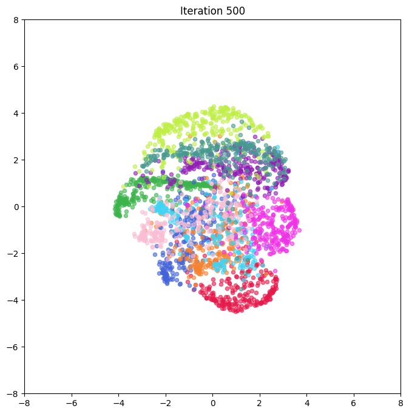
- **Symmetric SNE**: Less separation compared to t-SNE. The clusters overlap more, especially in the central region of the plot, although general group structures are still observable.
### Part 3
#### Symmetric SNE

**Similarity distributions (perplexity = 50):**

- High-dimensional space (P) vs. Low-dimensional space (Q)
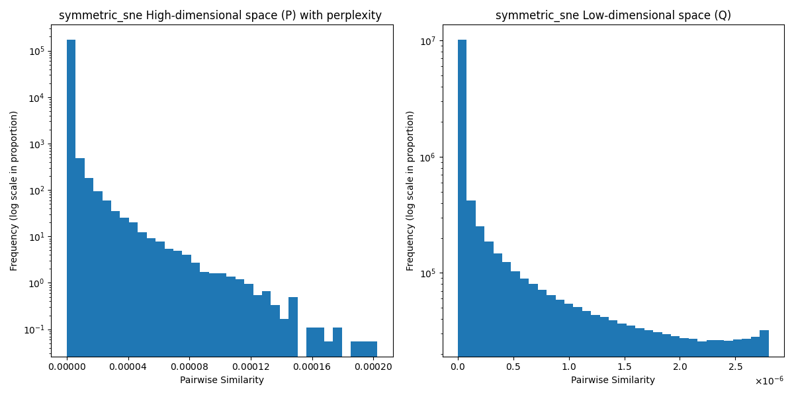
#### t-SNE

**Similarity distributions (perplexity = 50):**

- High-dimensional space (P) vs. Low-dimensional space (Q)
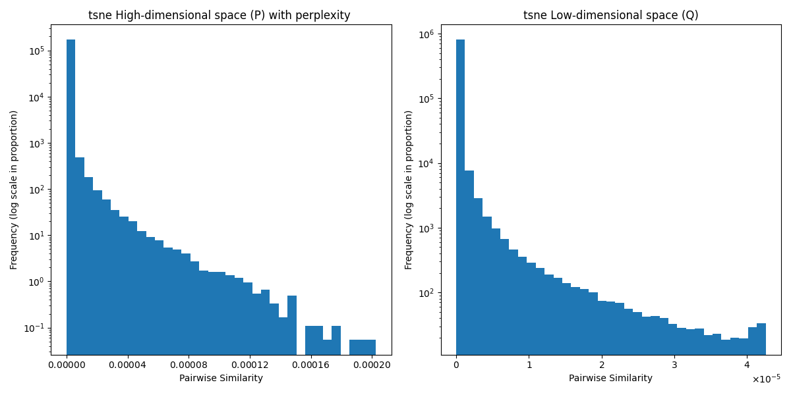
- In both methods, similarity distributions are **heavily skewed**, with most pairwise similarities near zero.

- **t-SNE** emphasizes preserving local similarity, resulting in a sharper drop in low-dimensional similarities (Q).

- **Symmetric SNE** distributes similarity values more evenly, leading to less separation in the low-dimensional embedding.

These differences directly reflect the methods' emphasis:
t-SNE's use of a heavy-tailed Student-t kernel in low-dimensional space encourages more separation between clusters, whereas symmetric SNE maintains more conservative spacing.
### Part 4
compare  the  effects  of  different  perplexity  values

#### tsne

| perplexity=10               | perplexity=20                |
| --------------------------- | ---------------------------- |
| 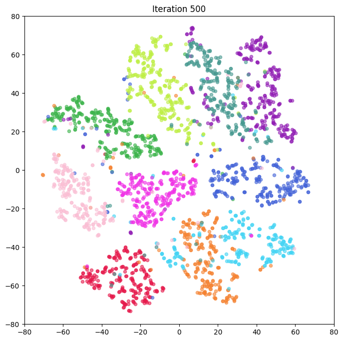 | 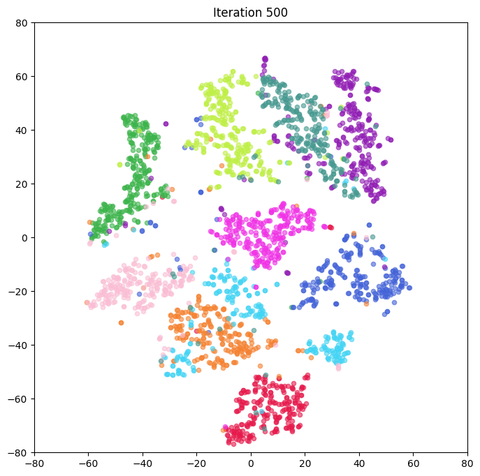  |
| perplexity=50               | perplexity=100               |
|  | 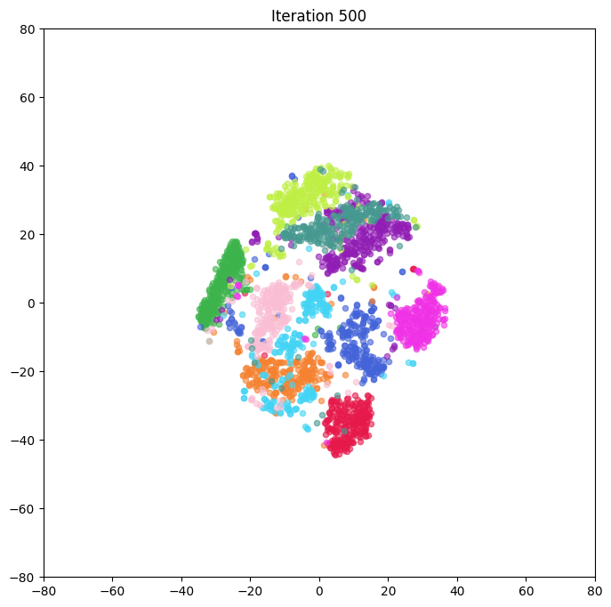 |

| Perplexity | Description                                                                                                                           |
| ---------- | ------------------------------------------------------------------------------------------------------------------------------------- |
| **10**     | Clusters are well separated, but highly fragmented. Some clusters are stretched or sparse. t-SNE focuses strongly on local structure. |
| **20**     | A better balance between local and global structure is achieved. Clusters are more compact and organized.                             |
| **50**     | Distinct clusters are still present, but there’s more overlap near boundaries. t-SNE begins to focus more on global structure.        |
| **100**    | Clusters become tighter but start to shrink towards the center. Global structure dominates; the embedding becomes more compact.       |
t-SNE is sensitive to perplexity. Smaller values preserve local neighborhoods better, while larger values encourage global compactness. Perplexity around **20–50** tends to yield the most interpretable clustering structure for MNIST.

#### ssne


| perplexity=10                        | perplexity=20                         |
| ------------------------------------ | ------------------------------------- |
| 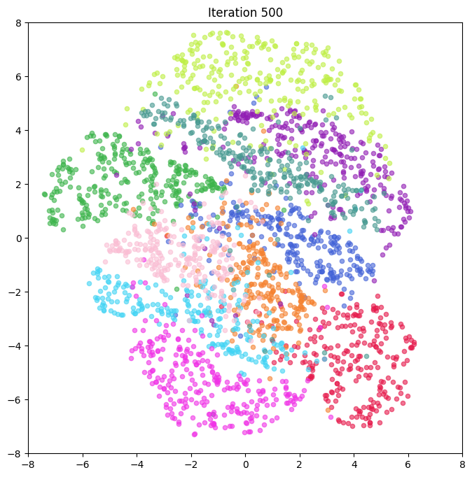 | 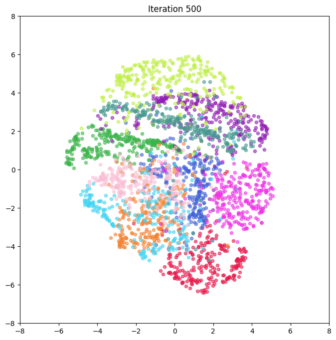  |
| perplexity=50                        | perplexity=100                        |
|  | 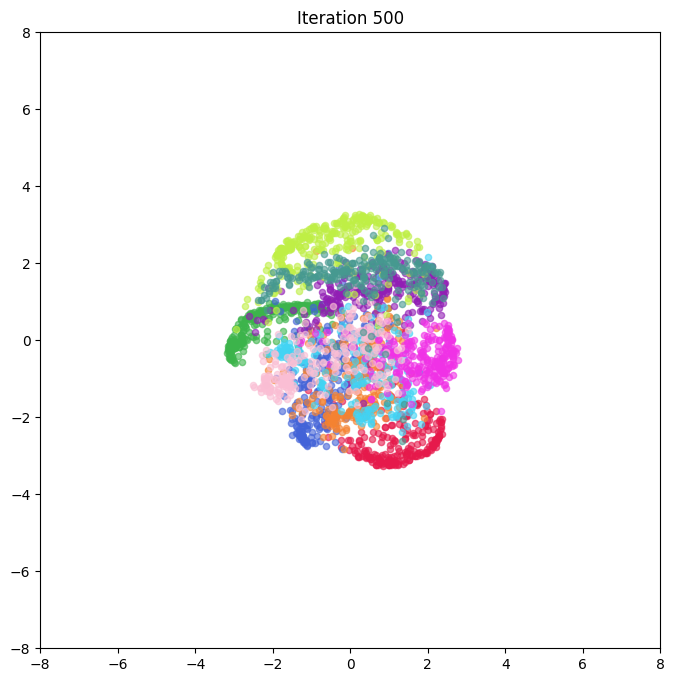 |

| Perplexity | Description                                                                                                |
| ---------- | ---------------------------------------------------------------------------------------------------------- |
| **10**     | Data points are dispersed in local neighborhoods but lack clear boundaries. Overall layout appears smooth. |
| **20**     | Slight improvement in cluster definition, but overlap between clusters remains.                            |
| **50**     | Visualization becomes denser and more centered. Cluster boundaries are vague.                              |
| **100**    | The embedding collapses into a dense central blob, indicating global similarity dominates entirely.        |

Symmetric SNE does not benefit as much from changing perplexity compared to t-SNE. Regardless of value, it produces smoother, more continuous manifolds, but lacks the sharp cluster separation seen in t-SNE.

#### Summary

- **t-SNE** is better at discovering and separating discrete clusters. A moderate **perplexity (20–50)** is ideal.

- **Symmetric SNE** emphasizes continuity and topology over separation. Larger perplexity compresses the embedding too tightly.

- **Choosing the right perplexity** is crucial for t-SNE, whereas symmetric SNE is relatively more robust to its variation but less interpretable for clustering tasks.

#   C. Observations and Discussion (10%)

## Effect of Perplexity on Similarity Distributions (Symmetric SNE)

To analyze the influence of perplexity on the similarity structures in symmetric SNE, I visualized both the high-dimensional pairwise similarities $P$ and the low-dimensional similarities $Q$ for four different perplexity values: 10, 20, 50, and 100. The corresponding plots are shown below:
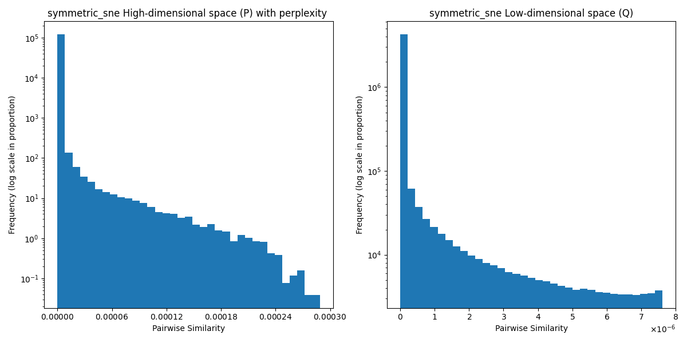
- **Figure S1.1** – Symmetric SNE Pairwise Similarity Distribution (perplexity=10)
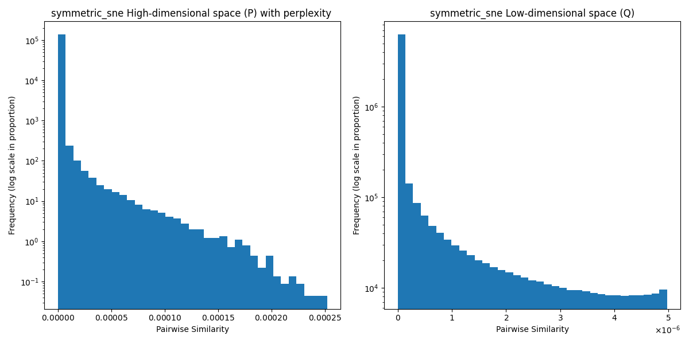
- **Figure S1.2** – Symmetric SNE Pairwise Similarity Distribution (perplexity=20)

- **Figure S1.3** – Symmetric SNE Pairwise Similarity Distribution (perplexity=50)
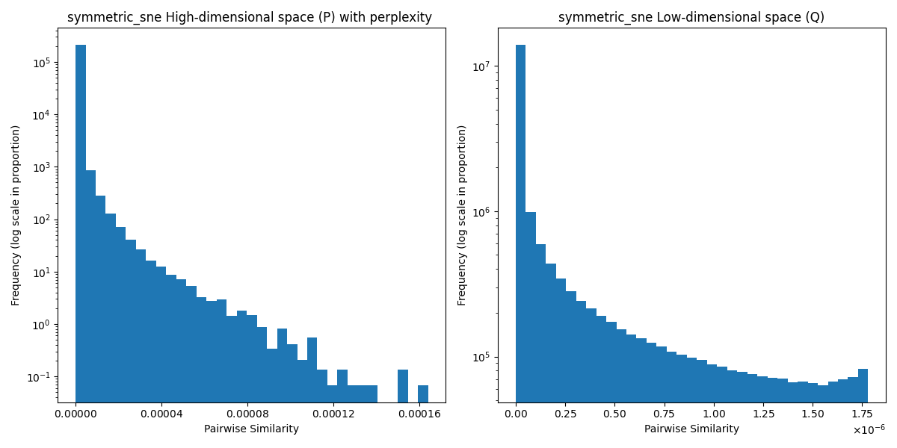
- **Figure S1.4** – Symmetric SNE Pairwise Similarity Distribution (perplexity=100)

### 1: High-dimensional similarity $P$ becomes smoother as perplexity increases

From the left-side plots in each figure (showing $P$), we can see that:

- With **perplexity = 10**, the distribution of $P$ is sharp and highly concentrated near zero. This implies that the Gaussian kernel assigns high similarity to only a few nearest neighbors, emphasizing **local structures**.

- With **perplexity = 100**, the similarity scores are more spread out, assigning non-negligible similarity to many more points. This reflects an emphasis on **global neighborhood relationships**.

This behavior is consistent with the role of perplexity: it controls the effective number of neighbors used to compute conditional probabilities in the high-dimensional space.

---

### 2: Low-dimensional similarity $Q$ always follows a heavy-tail distribution

The right-side plots in each figure (showing $Q$) exhibit the following behavior:

- Regardless of perplexity, the $Q$ distribution has a very sharp peak near zero and a long tail.

- As **perplexity increases**, the tail becomes heavier, meaning the low-dimensional space tends to pull apart more points, even those that are not close in the original space.


This is due to the use of a **Student-t distribution** (with 1 degree of freedom) in symmetric SNE, which has heavier tails than a Gaussian and is used to mitigate the **crowding problem**.

---

### 3: P vs. Q mismatch highlights the source of the gradient force

The KL divergence minimized in symmetric SNE is:

$\mathrm{KL}(P \,\|\, Q) = \sum_{i \ne j} P_{ij} \log \frac{P_{ij}}{Q_{ij}}$

- If $P$ is very sharp while $Q$ is too flat (or vice versa), the divergence becomes large, leading to stronger gradients that push similar points closer together.

- At **high perplexity**, PPP becomes too uniform, and $Q$ cannot compensate due to dimensional constraints—resulting in points **crowding** in the low-dimensional space.


This effect can be clearly observed in the final embedding results where points tend to cluster toward the center when perplexity is large.

